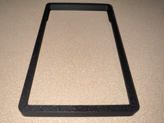
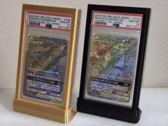
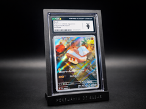

# Downloads: Bumpers de slabs

6 arquivo(s) de terceiros em 6 item(ns). Cada item tem pasta própria, função resumida, nome anterior, autoria e licença.

A prévia ajuda a reconhecer o modelo; para imprimir, abra o item e confira as plates e o perfil no Flash Studio.

| Prévia | Item | O que é | Maior peça (mm) | AD5X |
| --- | --- | --- | --- |
|  | [CGC Slab Bumper (TACB)](cgc-slab-bumper-tacb/README.md) | Bumper de proteção para slab CGC. | 86.2 × 141.0 × 9.6 | peças cabem |
|  | [PARAMETRIC GRADED CARD BUMPER GENERATOR - Protect!](parametric-graded-card-bumper-generator-protect/README.md) | Bumper paramétrico para proteger slab PSA. | 90.27 × 145.37 × 10.33 | peças cabem |
|  | [Press-fit Slab Case](press-fit-slab-case/README.md) | Case de slab com fechamento por pressão. | 98.0 × 153.0 × 6.7 | peças cabem |
|  | [PSA Graded Card Case 3D Printed Protective Holder](psa-graded-card-case-3d-printed-protective-holder/README.md) | Case protetor para slab PSA. | 98.0 × 14.0 × 153.0 | peças cabem |
|  | [PSA Slab Bumper 3-set](psa-slab-bumper-3-set/README.md) | Conjunto de três bumpers para slab PSA. | 86.4 × 12.2 × 141.4 | peças cabem |
|  | [Slab V1 with Base (P2S)](slab-v1-with-base-p2s/README.md) | Suporte com base para exibir slab graduada. | 145.52 × 90.18 × 7.94 | peças cabem |

AD5X indica se cada peça cabe individualmente na cama; a disposição conjunta das plates precisa ser conferida no Flash Studio. Autor, licença e perfil estão no README de cada item. Os dados completos estão em [index.json](../../index.json).
