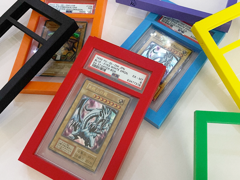

# PSA Graded Card Case 3D Printed Protective Holder

Case protetor para slab PSA.

## Arquivos

| Arquivo | Nome anterior | Maior peça (mm) | Perfil embutido | Trocar perfil? |
| --- | --- | --- | --- | --- |
| [bumper-main.3mf](bumper-main.3mf) | `bumper_main.3mf` | 98.0 × 14.0 × 153.0 | Bambu Lab A1 mini | sim |

**Autor:** MaskForge  
**Licença:** Standard Digital File License
**Peças cabem individualmente na AD5X:** sim

Este item é um download de terceiro. A prévia pode mostrar uma foto promocional, uma renderização da malha ou só uma das plates. As medidas consideram cada peça separadamente; confira a disposição das plates e o perfil no Flash Studio antes de imprimir.
