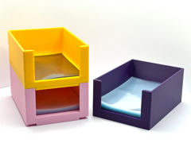

# Stackable Penny Sleeve Holder (Kobra 3, 15cm)

Porta-penny-sleeves empilhável com 15 cm de altura.

## Arquivos

| Arquivo | Nome anterior | Maior peça (mm) | Perfil embutido | Trocar perfil? |
| --- | --- | --- | --- | --- |
| [pennysleeveholderstacking-v2-kobra3-15cm.3mf](pennysleeveholderstacking-v2-kobra3-15cm.3mf) | `PennySleeveHolderStacking_V2_kobra3_15cm.3mf` | 73.0 × 101.5 × 150.0 | Anycubic Kobra 3 | sim |

**Autor:** Sazabi  
**Licença:** MakerWorld Exclusive License
**Peças cabem individualmente na AD5X:** sim

Este item é um download de terceiro. A prévia pode mostrar uma foto promocional, uma renderização da malha ou só uma das plates. As medidas consideram cada peça separadamente; confira a disposição das plates e o perfil no Flash Studio antes de imprimir.
