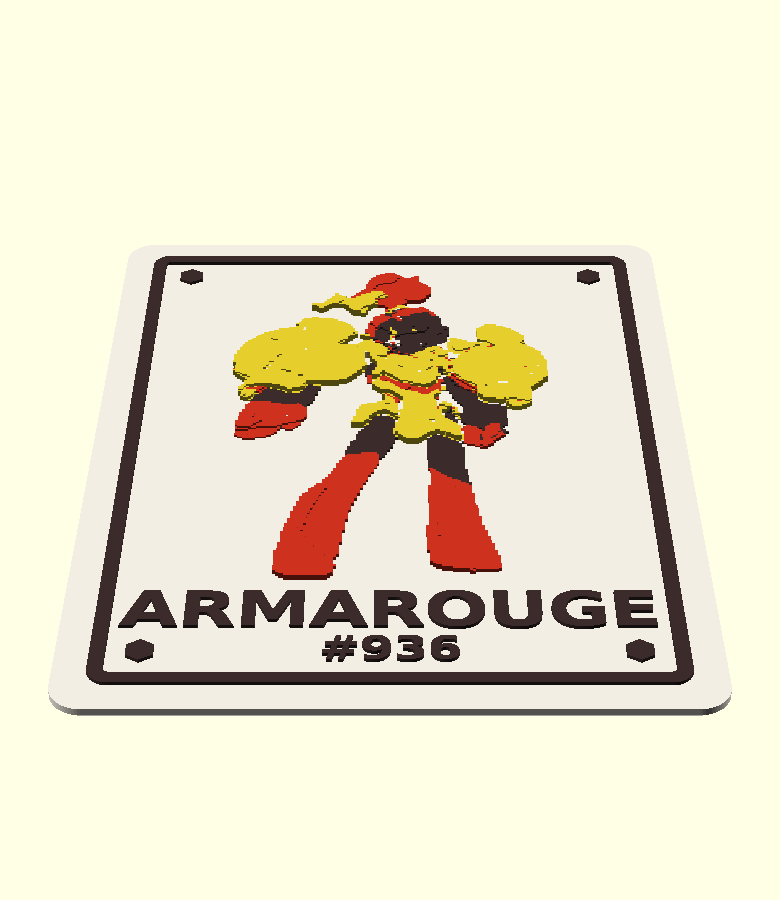
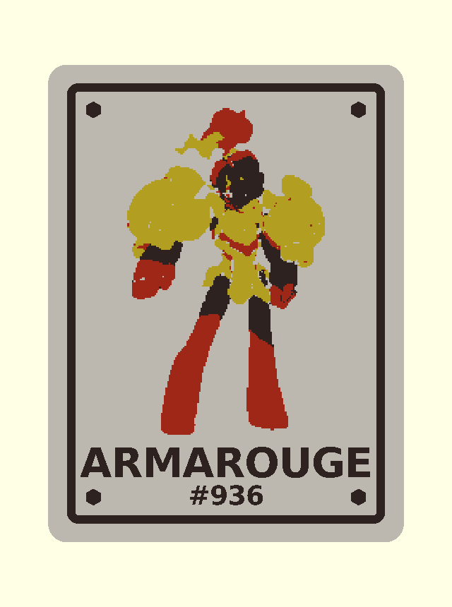

# pokemon-filler-card-01

Card "tapa-buraco" para completar espaços vazios do álbum Pokémon. Sai em
**67 × 90mm** de propósito — o card oficial é 63 × 88 e é justamente por isso
que ele fica solto no bolso. A arte é um **baixo-relevo de 4 níveis**, gerada
a partir de um SVG de trace colorido. Sai em duas versões do mesmo `.scad` e
do mesmo heightmap: **4 cores no IFS** ou **cor única**.

Primeira arte pronta: **Armarouge #936**.



## Por que 2,0mm no total

O corpo tem **1,2mm** (6 camadas a 0,20mm), a espessura mínima que ainda sai
sólida em FDM. O relevo soma até 0,8mm por cima, então o card acabado tem
**2,0mm** no ponto mais alto — a mesma espessura do insert do
`pokemon-coin-binder-01`, que já foi impresso e prova que 2,0mm entra neste
álbum.

## Medidas

- Card: **67,00 × 90,00 × 2,00mm** (corpo de 1,20mm + relevo de até 0,80mm)
- Quinas: raio **3,50mm**
- Chanfro de pé de elefante na aresta de baixo: **0,40mm**
- Janela de arte: **51,80 × 62,80mm**; a arte encaixa em **38,34 × 62,80mm**
- Heightmap: **128 × 209px**, resolução de **0,302mm/px**
- Níveis do relevo: **+0,20 / +0,40 / +0,60 / +0,80mm** acima da face —
  degrau de **0,20mm**, exatamente uma camada
- Moldura, hexágonos e texto: alto-relevo de **0,40mm**
- Piso sólido sob o heightmap: **0,927mm**

## As 4 cores

O card multicolor é **um objeto com 6 peças** em 4 filamentos. A divisão de
cor sai de um k-means na paleta do SVG ponderado por área — as 14 cores do
trace caem em 3 grupos cromáticos, e o 4º filamento é o corpo do card.

| Filamento | Peças | Cor sugerida |
|---|---|---|
| 1 | `corpo`, `arte-vao` | creme/branco — é também a armadura clara do Armarouge |
| 2 | `arte-amarelo` | `#e5cd2c` |
| 3 | `arte-vermelho` | `#cd321f` |
| 4 | `moldura-e-texto`, `arte-escuro` | `#3b2c2b` |

A moldura e o texto entram no filamento 4 de propósito: dão contraste sem
gastar um 5º slot do IFS.

**O 3MF já abre colorido.** As cores vão gravadas em
`Metadata/project_settings.config` — sem esse arquivo o 3MF carrega só o
*número* do filamento e o card abre cinza, que foi como a v1 saiu.

Isso é um desvio consciente da regra do `plates.py`, que manda **não** escrever
`project_settings.config`. Aquela regra existe para não arrastar o perfil de
impressora de outra pessoa junto (o `Jabonera.3mf` do repo, por exemplo, vem
com uma Anycubic Kobra 3 e camada de 0,1mm). Aqui o arquivo tem **só seis
chaves, todas de filamento** — cor, tipo, diâmetro, densidade e índice. Nenhuma
chave de impressora, de processo ou de altura de camada, então o seu perfil
continua valendo.

Se quiser trocar as cores, é um parâmetro:

```sh
python3 multicolor3mf.py ... --colors "#F2EDE3,#E5CD2C,#CD321F,#3B2C2B"
```



## Arquivos

- `pokemon-filler-card-01.scad` — fonte paramétrico (`part`: `card`, `plate`,
  `body`, `trim`)
- `svg2relief.py` — SVG de trace colorido → heightmap PNG **e** malhas de cor
- `multicolor3mf.py` — monta o 3MF de um objeto com N peças, uma por filamento
- `preview-4cores.scad` — só para olhar: remonta as peças com as cores
- `art/armarouge.svg` — trace de origem (202 paths, 14 cores)
- `art/armarouge.png` — heightmap gerado
- `3mf/pokemon-filler-card-01-armarouge-4cores.3mf` — **job recomendado**
- `3mf/pokemon-filler-card-01-armarouge.3mf` — cor única, 1 card
- `3mf/pokemon-filler-card-01-armarouge-x4.3mf` — cor única, chapa 2×2

## Como adicionar um Pokémon novo

Precisa de **um SVG por Pokémon**, de trace colorido: regiões de cor chapada,
contorno fechado, **sem `stroke`**. A luminância de cada cor vira altura.

```sh
python3 svg2relief.py art/<nome>.svg art/<nome>.png --px-w 128 --levels 4 \
    --parts-dir stl --part-prefix pokemon-filler-card-01-<nome> --colors 3
```

O script imprime as dimensões em px — jogar esses números em `png_w`/`png_h`
no `.scad`, junto com `relief_png`, `name_text` e `dex_text`. Depois:

```sh
flatpak run org.openscad.OpenSCAD -o stl/pokemon-filler-card-01-<nome>.stl pokemon-filler-card-01.scad
flatpak run org.openscad.OpenSCAD -o 3mf/pokemon-filler-card-01-<nome>.3mf pokemon-filler-card-01.scad
flatpak run org.openscad.OpenSCAD -o 3mf/pokemon-filler-card-01-<nome>-x4.3mf -D 'part="plate"' pokemon-filler-card-01.scad
```

E o multicolor (o `body` e o `trim` não dependem do Pokémon, gera uma vez só):

```sh
flatpak run org.openscad.OpenSCAD -o stl/pokemon-filler-card-01-body.stl -D 'part="body"' pokemon-filler-card-01.scad
flatpak run org.openscad.OpenSCAD -o stl/pokemon-filler-card-01-trim.stl -D 'part="trim"' pokemon-filler-card-01.scad
python3 multicolor3mf.py 3mf/pokemon-filler-card-01-<nome>-4cores.3mf --name "<nome>" \
    --part corpo 1 stl/pokemon-filler-card-01-body.stl \
    --part moldura-e-texto 4 stl/pokemon-filler-card-01-trim.stl \
    --part arte-vao 1 stl/pokemon-filler-card-01-<nome>-vao.stl \
    --part arte-amarelo 2 stl/pokemon-filler-card-01-<nome>-cor1.stl \
    --part arte-vermelho 3 stl/pokemon-filler-card-01-<nome>-cor2.stl \
    --part arte-escuro 4 stl/pokemon-filler-card-01-<nome>-cor3.stl \\
    --colors "#F2EDE3,#E5CD2C,#CD321F,#3B2C2B"
```

Os nomes `cor1/cor2/cor3` são só a ordem por área — **confira o hex que o
`svg2relief.py` imprime** e renomeie as peças, porque num Pokémon azul a
`cor1` não vai ser amarela.

## Armadilhas já pagas

- **`surface()` faz rampa, não degrau vertical.** A transição entre níveis é
  uma rampa de 1px (0,30mm). Numa vista de topo ortográfica o relevo aparece
  como contorno enquanto a moldura e o texto somem — por motivo oposto, que é
  parede vertical ter área projetada zero vista de cima.
- **8 níveis de 0,1mm foi testado e rejeitado.** O nível mais baixo da figura
  ficava a 0,056mm da face: a silhueta não descolava do card e a arte sumia.
  4 níveis de 0,2mm dão degrau de uma camada inteira e leem de longe.
- **`art_flip_y = false`.** O `surface()` já põe a primeira linha do PNG no y
  máximo; com `true` a figura sai de cabeça para baixo. Conferido em render
  de topo, não deduzido.
- **A equalização por quantil do `svg2relief.py` não é enfeite.** No mapa
  linear de luminância, 70% da área da figura caía num nível só e o relevo
  ficava chapado. Com equalização: 23,5% / 22,9% / 10,7% / 42,8%.
- **As peças de cor não saem do OpenSCAD.** Quem tem o mapa de cor pixel a
  pixel é o `svg2relief.py`, então é ele que emite as malhas — assim a cor
  casa com o relevo sem meio-pixel de desalinhamento.
- **Malhar as peças de cor como casca única de campo de alturas vaza.** Deu
  734 arestas sem par na `cor1`, por T-junction nas arestas verticais de canto
  onde três células de alturas diferentes se encontram. A versão boa é caixa
  fundida por *greedy meshing*: cada caixa fecha sozinha (0 abertas em 1262).
  A soma das áreas de topo das 4 peças deu 1045,9mm² contra 1046,1 esperados,
  o que prova que elas ladrilham a figura sem sobra nem vão.
- **Moldura descentrada (corrigido).** `offset(r)` cresce para os **dois**
  lados; o `translate` não compensava o raio, e a moldura saía a 1,30mm da
  borda esquerda e 5,70mm da direita. Agora é 3,50mm nos quatro lados, com
  ECHO de conferência para não regredir em silêncio.
- **`import()` de SVG ignora cor.** Num trace colorido ele funde os 202 paths
  numa mancha só. O caminho `art_src="svg"` só serve para SVG que já seja
  silhueta.
- **Escalas medidas nesta máquina** (OpenSCAD 2021.01), não chutadas:
  `import()` de SVG lê a **72dpi** (1px = 0,352778mm) honrando `width`/`height`
  e `viewBox`; `surface()` mapeia cinza 0 → z 0 e cinza 255 → z 100, linear,
  1px = 1 unidade em XY, e fecha o fundo do sólido 1 unidade abaixo do mínimo.

## Impressão

- Orientação já correta no STL/3MF: **verso na placa**, relevo para cima.
- **Sem suporte**, sem ponte, peça única.
- **Brim recomendado.** 67 × 90 com só 1,2mm de corpo é a geometria clássica
  de empeno; é por isso que a chapa é 2×2 (138 × 184mm) e não 3×2 — 3×2 cabe
  na cama (209 × 184mm) mas encosta no limite de conforto de 210mm do repo e
  não sobra margem para o brim.
- Altura de camada **0,20mm**: cada degrau do relevo cai exatamente numa
  fronteira de camada.
- Placa lisa. Deixar a mesa esfriar antes de tirar, para não empenar.

## Pendências

- **Não impresso ainda.** Falta o teste físico confirmar duas coisas: que
  2,0mm entra folgado no bolso do álbum, e que o degrau de 0,2mm lê a olho nu.
- **O 3MF multicolor não foi aberto no Flash Studio.** O slicer não roda
  headless nesta máquina. A estrutura foi conferida lendo o arquivo de volta
  (6 peças, filamentos 1–4 com as cores certas, objeto centrado na cama e
  apoiado em z=0), mas confirmar que ele aparece como **um objeto com 6
  peças**, cada uma no filamento e na cor certa, é passo seu. Se ele reclamar
  do `project_settings.config` parcial, o teste é abrir sem ele: gerar de novo
  sem `--colors` e ver se aí carrega.
- **Chapa multicolor não existe.** Só o card avulso. 4 cards iguais em 4 cores
  seria muito purge; se quiser, dá pra gerar.
