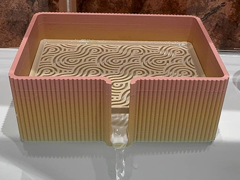

# Downloads: Casa

2 arquivo(s) de terceiros em 2 item(ns). Cada item tem pasta própria, função resumida, nome anterior, autoria e licença.

A prévia ajuda a reconhecer o modelo; para imprimir, abra o item e confira as plates e o perfil no Flash Studio.

| Prévia | Item | O que é | Maior peça (mm) | AD5X |
| --- | --- | --- | --- |
|  | [Cup Holder Trashcan](cup-holder-trashcan/README.md) | Lixeira pequena para encaixar em porta-copos. | 99.57 × 95.58 × 150.0 | peças cabem |
|  | [Self-draining Soap Dish](self-draining-soap-dish/README.md) | Saboneteira com escoamento de água. | 126.9 × 101.85 × 46.0 | peças cabem |

AD5X indica se cada peça cabe individualmente na cama; a disposição conjunta das plates precisa ser conferida no Flash Studio. Autor, licença e perfil estão no README de cada item. Os dados completos estão em [index.json](../../index.json).
