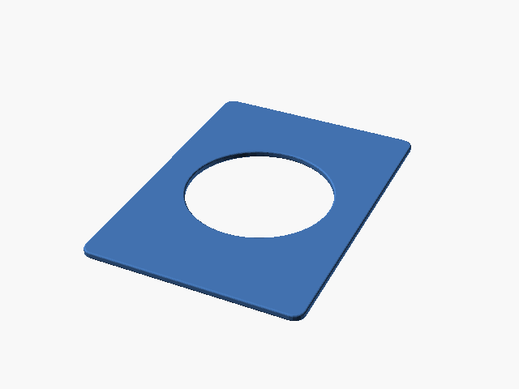
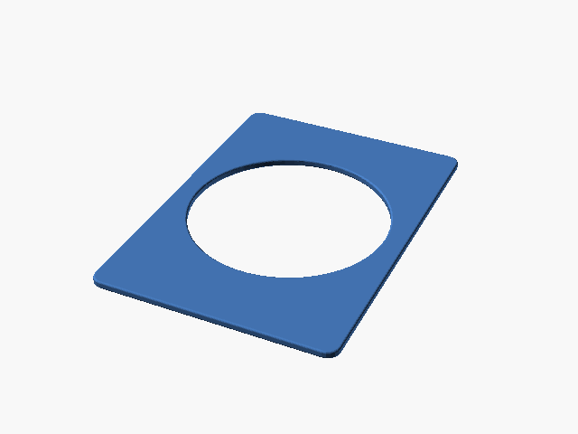
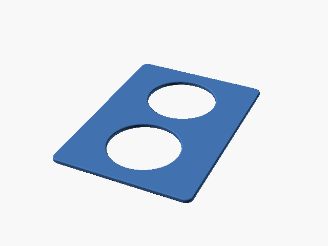

# Downloads: Porta-moedas

6 arquivo(s) de terceiros em 6 item(ns). Cada item tem pasta própria, função resumida, nome anterior, autoria e licença.

A prévia ajuda a reconhecer o modelo; para imprimir, abra o item e confira as plates e o perfil no Flash Studio.

| Prévia | Item | O que é | Maior peça (mm) | AD5X |
| --- | --- | --- | --- |
|  | [Münzständer für 1OZ Silbermünzen mit Kapsel 45,5mm](munzstander-fur-1oz-silbermunzen-mit-kapsel-45-5mm/README.md) | Expositor de moeda de prata de 1 oz em cápsula de 45,5 mm. | 45.12 × 40.28 × 35.0 | peças cabem |
|  | [Pokemon Coin Cards - 30mm e 34mm](pokemon-coin-cards-30mm-e-34mm/README.md) | Cards para guardar moedas Pokémon de 30 e 34 mm em fichário. | 63.0 × 88.0 × 2.0 | peças cabem |
|  | [Pokémon 42mm Coin Binder Holder](pokemon-42mm-coin-binder-holder/README.md) | Insert de moeda Pokémon de 42 mm para fichário. | 63.0 × 88.0 × 2.0 | peças cabem |
|  | [Pokémon 51.5mm Coin Binder Holder](pokemon-51-5mm-coin-binder-holder/README.md) | Insert de moeda Pokémon de 51,5 mm para fichário. | 63.0 × 88.0 × 2.0 | peças cabem |
|  | [Pokémon Status Coin Binder Holder (1)](pokemon-status-coin-binder-holder-1/README.md) | Insert para moeda de status Pokémon, variante 1. | 63.0 × 88.0 × 2.0 | peças cabem |
|  | [Pokémon Status Coin Binder Holder (2)](pokemon-status-coin-binder-holder-2/README.md) | Insert para moedas de status Pokémon, variante 2. | 63.0 × 88.0 × 2.0 | peças cabem |

AD5X indica se cada peça cabe individualmente na cama; a disposição conjunta das plates precisa ser conferida no Flash Studio. Autor, licença e perfil estão no README de cada item. Os dados completos estão em [index.json](../../index.json).
