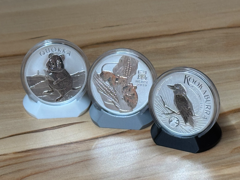

# Münzständer für 1OZ Silbermünzen mit Kapsel 45,5mm

Expositor de moeda de prata de 1 oz em cápsula de 45,5 mm.

## Arquivos

| Arquivo | Nome anterior | Maior peça (mm) | Perfil embutido | Trocar perfil? |
| --- | --- | --- | --- | --- |
| [munzstander-1oz-perth.3mf](munzstander-1oz-perth.3mf) | `Münzständer_1oz_Perth_.3mf` | 45.12 × 40.28 × 35.0 | Bambu Lab P1S | sim |

**Autor:** Michael S.  
**Licença:** Standard Digital File License
**Peças cabem individualmente na AD5X:** sim

Este item é um download de terceiro. A prévia pode mostrar uma foto promocional, uma renderização da malha ou só uma das plates. As medidas consideram cada peça separadamente; confira a disposição das plates e o perfil no Flash Studio antes de imprimir.
