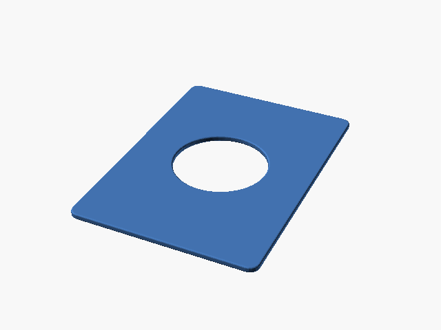

# Pokémon Status Coin Binder Holder (1)

Insert para moeda de status Pokémon, variante 1.

## Arquivos

| Arquivo | Nome anterior | Maior peça (mm) | Perfil embutido | Trocar perfil? |
| --- | --- | --- | --- | --- |
| [pokemon-status-coin-binder-holder-1.stl](pokemon-status-coin-binder-holder-1.stl) | `Pokemon_Status-Coin_Binder-Holder_1.stl` | 63.0 × 88.0 × 2.0 | sem perfil identificado | a confirmar |

**Autor:** a confirmar  
**Licença:** a confirmar
**Peças cabem individualmente na AD5X:** sim

Este item é um download de terceiro. A prévia pode mostrar uma foto promocional, uma renderização da malha ou só uma das plates. As medidas consideram cada peça separadamente; confira a disposição das plates e o perfil no Flash Studio antes de imprimir.
