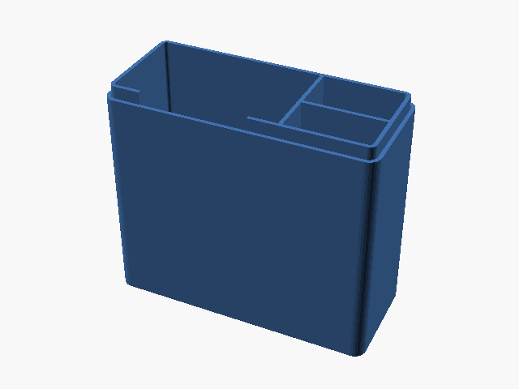
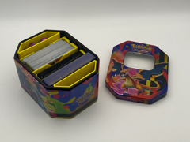

# Downloads: Deckboxes e estojos

2 arquivo(s) de terceiros em 2 item(ns). Cada item tem pasta própria, função resumida, nome anterior, autoria e licença.

A prévia ajuda a reconhecer o modelo; para imprimir, abra o item e confira as plates e o perfil no Flash Studio.

| Prévia | Item | O que é | Maior peça (mm) | AD5X |
| --- | --- | --- | --- |
|  | [Deck Box Pokémon 60 (Double Sleeve)](deck-box-pokemon-60-double-sleeve/README.md) | Deckbox para 60 cartas Pokémon com double sleeve. | 111.8 × 47.2 × 92.6 | peças cabem |
|  | [Printed inserts and organiser for Pokemon Hex Tins](printed-inserts-and-organiser-for-pokemon-hex-tins/README.md) | Moldura e divisórias para reutilizar lata hexagonal Pokémon. | 108.88 × 145.0 × 76.6 | peças cabem |

AD5X indica se cada peça cabe individualmente na cama; a disposição conjunta das plates precisa ser conferida no Flash Studio. Autor, licença e perfil estão no README de cada item. Os dados completos estão em [index.json](../../index.json).
