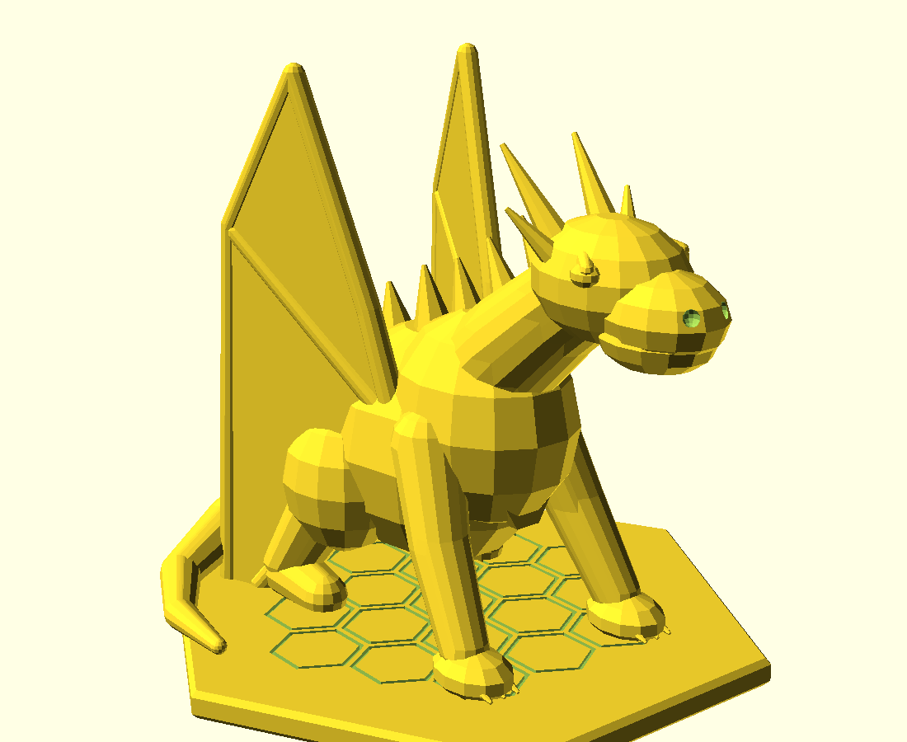

# dragon-01

Dragão sentinela decorativo em estilo **low-poly**, agachado sobre uma base
hexagonal. É uma **peça única**: corpo, patas, cauda e as duas asas se unem à
base. As membranas descem até o pedestal, evitando que asas grandes comecem no
ar e deixando a estátua mais resistente ao manuseio.

| | |
|---|---|
| Dimensões medidas no STL | **108,0 × 110,2 × 99,8 mm** |
| Peças | 1 |
| Orientação | base na mesa; cabeça para `+Y` |
| Arquivo de impressão | `3mf/dragon-01-plate.3mf` |
| STL de referência | `stl/dragon-01.stl` |
| Impressora-alvo | Bambu Lab A1 mini |
| Volume geométrico | 131,52 cm³ (sólido; não é consumo fatiado) |
| Malha | 7.910 triângulos, fechada, uma superfície, 2-manifold |

## Construção

- Corpo facetado, pescoço elevado, focinho com narinas, olhos em relevo e dois
  pares de chifres.
- Quatro patas apoiadas; três garras em cada pata dianteira.
- Cauda afilada e enrolada para dentro do contorno do pedestal.
- Asas dobradas para trás, com membrana de **2,8 mm** e nervuras estruturais.
- Base chanfrada de **5 mm**, com 17 células hexagonais em baixo-relevo; quatro
  escamas hexagonais no peito repetem a identidade visual do repositório.

## Impressão

O 3MF já está na orientação correta. Use PLA com altura de camada de 0,16 ou
0,20 mm, 3 paredes e 12–15% de infill gyroid. Não use brim antes de testar a
adesão: a base fornece cerca de **7.883 mm²** na primeira camada.

As asas foram desenhadas como paredes quase verticais e apoiadas na base, mas
o corpo orgânico ainda tem faces descendentes sob barriga e queixo. A auditoria
da malha encontrou **1.749,6 mm²** além do limite de 45°. Para acabamento
previsível, use suporte **orgânico, somente na mesa**, sem preencher entre asa
e corpo. Confira a prévia do fatiador antes de enviar o job.

## Escala

Pode ser ampliado livremente. Evite reduzir abaixo de **80%**: a membrana das
asas cairia de 2,8 para 2,24 mm, e garras/pontas passariam a ter detalhes finos
demais para um bico de 0,4 mm.

## Pendência

Modelo ainda não validado em impressão física. O primeiro exemplar deve ser
tratado como teste de geometria, acabamento das pontas e remoção dos suportes.
