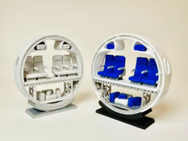
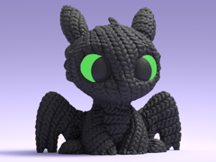
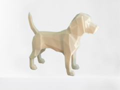
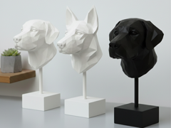
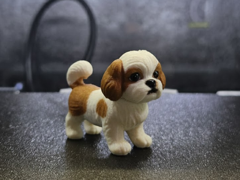
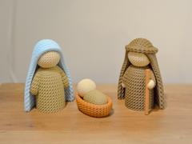
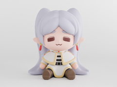
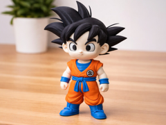
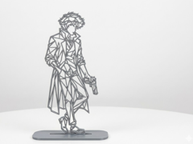

# Downloads: Figuras

19 arquivo(s) de terceiros em 19 item(ns). Cada item tem pasta própria, função resumida, nome anterior, autoria e licença.

A prévia ajuda a reconhecer o modelo; para imprimir, abra o item e confira as plates e o perfil no Flash Studio.

| Prévia | Item | O que é | Maior peça (mm) | AD5X |
| --- | --- | --- | --- |
|  | [Airplane Cross-Section Slice (Miniature Diorama)](airplane-cross-section-slice-miniature-diorama/README.md) | Diorama de seção transversal de avião. | 61.71 × 61.0 × 14.0 | peças cabem |
|  | [Banguela decorativo](banguela-decorativo/README.md) | Banguela decorativo. | 63.13 × 44.09 × 62.1 | peças cabem |
|  | [Baymax de uma cor](baymax-de-uma-cor/README.md) | Baymax de uma cor. | 60.25 × 36.71 × 71.25 | peças cabem |
|  | [Beagle low poly](beagle-low-poly/README.md) | Beagle low poly. | 80.0 × 26.37 × 66.37 | peças cabem |
|  | [Busto de boxer com pescoço](busto-de-boxer-com-pescoco/README.md) | Busto de boxer com pescoço. | 89.87 × 115.62 × 156.43 | peças cabem |
|  | [Busto de shih tzu](busto-de-shih-tzu/README.md) | Busto de shih tzu. | 163.74 × 155.4 × 143.03 | peças cabem |
|  | [Busto de Spike Spiegel](busto-de-spike-spiegel/README.md) | Busto de Spike Spiegel. | 97.37 × 113.94 × 150.0 | peças cabem |
|  | [Cachorro beagle](cachorro-beagle/README.md) | Cachorro beagle. | 76.65 × 145.22 × 110.31 | peças cabem |
|  | [Cachorro boxer sentado](cachorro-boxer-sentado/README.md) | Cachorro boxer sentado. | 58.21 × 92.0 × 100.0 | peças cabem |
|  | [Cachorro shih tzu](cachorro-shih-tzu/README.md) | Cachorro shih tzu. | 42.52 × 67.73 × 54.88 | peças cabem |
|  | [Charmander miniatura](charmander-miniatura/README.md) | Charmander miniatura. | 50.86 × 62.56 × 57.4 | peças cabem |
|  | [Cute Crochet Nativity Christmas couple and baby](cute-crochet-nativity-christmas-couple-and-baby/README.md) | Conjunto decorativo de presépio com três figuras. | 54.12 × 33.3 × 70.68 | peças cabem |
|  | [Familia Sagrada](familia-sagrada/README.md) | Familia Sagrada. | 82.48 × 70.67 × 98.1 | peças cabem |
|  | [Frieren em estilo chibi](frieren-em-estilo-chibi/README.md) | Frieren em estilo chibi. | 71.52 × 48.16 × 80.0 | peças cabem |
|  | [Goku em estilo chibi](goku-em-estilo-chibi/README.md) | Goku em estilo chibi. | 65.12 × 41.63 × 92.75 | peças cabem |
|  | [Mew chibi](mew-chibi/README.md) | Miniatura do Pokémon Mew em estilo chibi. | 58.83 × 90.34 × 83.33 | peças cabem |
|  | [Shih tzu em estilo Funko](shih-tzu-em-estilo-funko/README.md) | Shih tzu em estilo Funko. | 80.0 × 71.32 × 76.54 | peças cabem |
|  | [Spike Spiegel em aramado](spike-spiegel-em-aramado/README.md) | Spike Spiegel em aramado. | 176.01 × 169.49 × 7.99 | peças cabem |
|  | [Spike Spiegel em estilo chibi](spike-spiegel-em-estilo-chibi/README.md) | Spike Spiegel em estilo chibi. | 64.47 × 64.47 × 104.01 | peças cabem |

AD5X indica se cada peça cabe individualmente na cama; a disposição conjunta das plates precisa ser conferida no Flash Studio. Autor, licença e perfil estão no README de cada item. Os dados completos estão em [index.json](../../index.json).
