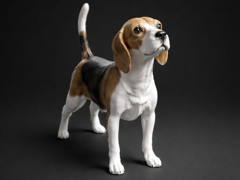

# Cachorro beagle

Cachorro beagle.

## Arquivos

| Arquivo | Nome anterior | Maior peça (mm) | Perfil embutido | Trocar perfil? |
| --- | --- | --- | --- | --- |
| [beagle.3mf](beagle.3mf) | `Beagle.3mf` | 76.65 × 145.22 × 110.31 | Bambu Lab P1S | sim |

**Autor:** AnKoDesign  
**Licença:** Standard Digital File License
**Título no 3MF:** Beagle - Modell eines Beagles
**Peças cabem individualmente na AD5X:** sim

**Nota:** Autor, licença, título de origem e perfil extraídos dos metadados embutidos no 3MF; arquivo encontrado fora do catálogo anterior.

Este item é um download de terceiro. A prévia pode mostrar uma foto promocional, uma renderização da malha ou só uma das plates. As medidas consideram cada peça separadamente; confira a disposição das plates e o perfil no Flash Studio antes de imprimir.
