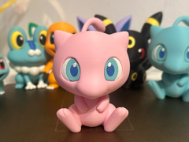

# Mew chibi

Miniatura do Pokémon Mew em estilo chibi.

## Arquivos

| Arquivo | Nome anterior | Maior peça (mm) | Perfil embutido | Trocar perfil? |
| --- | --- | --- | --- | --- |
| [mew-chibi.3mf](mew-chibi.3mf) | `AMS.3mf` | 58.83 × 90.34 × 83.33 | Bambu Lab A1 | sim |

**Autor:** Atseini  
**Licença:** Standard Digital File License
**Título no 3MF:** Mew Chibi
**Peças cabem individualmente na AD5X:** sim

**Nota:** Autor, licença, título de origem e perfil extraídos dos metadados embutidos no 3MF; arquivo encontrado fora do catálogo anterior.

Este item é um download de terceiro. A prévia pode mostrar uma foto promocional, uma renderização da malha ou só uma das plates. As medidas consideram cada peça separadamente; confira a disposição das plates e o perfil no Flash Studio antes de imprimir.
