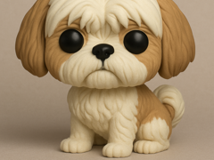

# Shih tzu em estilo Funko

Shih tzu em estilo Funko.

## Arquivos

| Arquivo | Nome anterior | Maior peça (mm) | Perfil embutido | Trocar perfil? |
| --- | --- | --- | --- | --- |
| [funko-sihtzu.3mf](funko-sihtzu.3mf) | `funko_sihtzu.3mf` | 80.0 × 71.32 × 76.54 | Bambu Lab X1 Carbon | sim |

**Autor:** gm3d.design  
**Licença:** Standard Digital File License
**Título no 3MF:** Funko sihtzu
**Peças cabem individualmente na AD5X:** sim

**Nota:** Autor, licença, título de origem e perfil extraídos dos metadados embutidos no 3MF; arquivo encontrado fora do catálogo anterior.

Este item é um download de terceiro. A prévia pode mostrar uma foto promocional, uma renderização da malha ou só uma das plates. As medidas consideram cada peça separadamente; confira a disposição das plates e o perfil no Flash Studio antes de imprimir.
