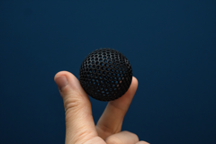
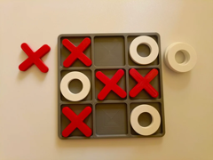

# Downloads: Jogos

2 arquivo(s) de terceiros em 2 item(ns). Cada item tem pasta própria, função resumida, nome anterior, autoria e licença.

A prévia ajuda a reconhecer o modelo; para imprimir, abra o item e confira as plates e o perfil no Flash Studio.

| Prévia | Item | O que é | Maior peça (mm) | AD5X |
| --- | --- | --- | --- |
|  | [Airless Ping Pong Ball](airless-ping-pong-ball/README.md) | Bola de pingue-pongue vazada, sem ar pressurizado. | 39.93 × 39.93 × 39.97 | peças cabem |
|  | [Tic tac toe Game](tic-tac-toe-game/README.md) | Conjunto para jogar jogo da velha. | 168.0 × 168.0 × 8.0 | peças cabem |

AD5X indica se cada peça cabe individualmente na cama; a disposição conjunta das plates precisa ser conferida no Flash Studio. Autor, licença e perfil estão no README de cada item. Os dados completos estão em [index.json](../../index.json).
