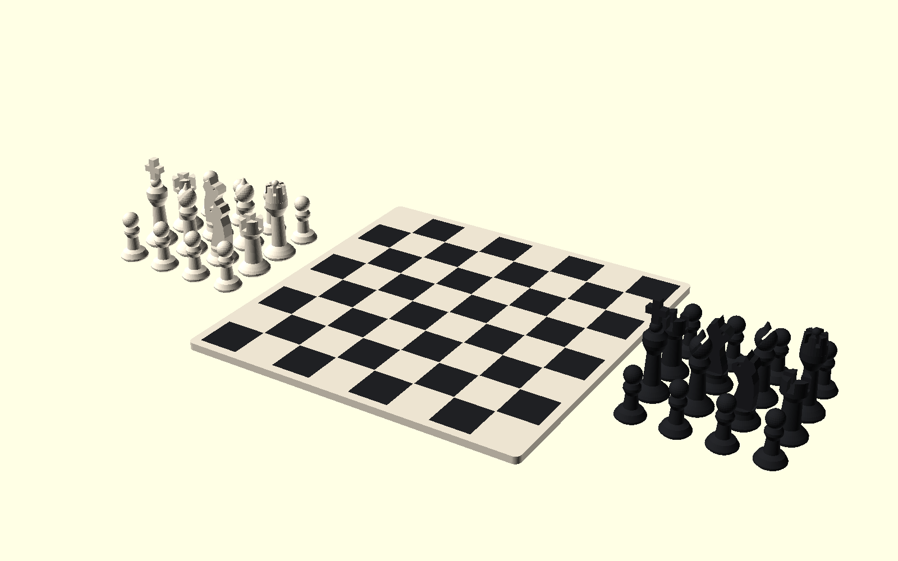

# xadrez-01

Conjunto de xadrez compacto completo, desenhado para imprimir **tabuleiro + 32
peças de uma vez** usando somente **duas cores**.

> ## ⚠️ NÃO IMPRIME NA AD5X COMO ESTÁ
>
> Esta placa foi dimensionada para a impressora **antiga** (Creality K2, cama
> de 260 × 260). Ela mede **168 × 248,2 mm** — os 248,2 de Y **estouram os
> 220 mm** da FlashForge AD5X, que hoje é a única impressora do usuário.
>
> A geometria das peças e do tabuleiro está boa e cabe folgada; o que não
> cabe é a **disposição em placa única**. Para imprimir na AD5X é preciso
> **relayoutar em dois jobs** — tabuleiro (168 × 168) num, as 32 peças
> noutro. Enquanto isso não for feito, o `.3mf` abaixo serve só de
> referência histórica.

| | |
|---|---|
| Arquivo para imprimir | [`3mf/xadrez-01-placa-bicolor.3mf`](./3mf/xadrez-01-placa-bicolor.3mf) |
| Conteúdo | 1 tabuleiro + 16 peças claras + 16 peças escuras |
| Cores | 2 corpos nomeados e atribuídos aos filamentos 1 e 2 |
| Envelope da placa | **168,0 × 248,2 × 46,0 mm** |
| Tabuleiro | **168 × 168 × 3,6 mm** |
| Casas | **20 × 20 mm**; área de jogo 160 × 160 mm |
| Malha no FlashForge Print | 50.396 triângulos, manifold, 65 volumes |
| Suportes | nenhum |
| Impressora-alvo | ⚠️ placa feita p/ Creality K2 (260) — **não cabe** na AD5X (220) |

## O que vem no conjunto

Cada lado tem oito peões, duas torres, dois cavalos, dois bispos, uma dama e um
rei. As peças seguem uma silhueta Staunton simplificada e foram redesenhadas
para FDM: o cavalo é um perfil autoportante de 6 mm, a cruz do rei vence só
2,9 mm por lado e os recortes de torre, bispo e dama não exigem suporte.

| Peça | Quantidade | Dimensões de uma unidade |
|---|---:|---:|
| Peão | 16 | 13,6 × 13,6 × 24,5 mm |
| Torre | 4 | 16,0 × 16,0 × 28,8 mm |
| Cavalo | 4 | 16,0 × 16,0 × 33,5 mm |
| Bispo | 4 | 15,8 × 15,8 × 37,5 mm |
| Dama | 2 | 16,2 × 16,2 × 37,1 mm |
| Rei | 2 | 16,2 × 16,2 × 46,0 mm |

O tabuleiro é uma única peça física: a cor clara forma uma laje contínua e as
32 casas escuras ocupam somente os 0,6 mm superiores. Um filete claro de 0,4
mm separa as casas escuras e evita fronteiras ambíguas no fatiador.

## Como abrir e imprimir

1. Abra o 3MF no FlashForge Print e selecione **FlashForge AD5X 0.4 nozzle**.
2. Confirme os dois componentes do conjunto:
   - `COR 1 CLARA - tabuleiro e 16 pecas` → slot claro do CFS;
   - `COR 2 ESCURA - casas e 16 pecas` → slot escuro do CFS.
3. Não use **Organizar automaticamente** nem separe a montagem: os dois corpos
   já compartilham o alinhamento exato.
4. Use PLA, perfil 0,20 mm Standard, 2 paredes, 15% de infill e suporte
   desligado. Limpe bem a chapa antes do job longo.

O teste de fatiamento foi feito no FlashForge Print 7.2.1 com os perfis oficiais
`0.20mm Standard @FlashForge AD5X 0.4 nozzle` e `Generic PLA @FlashForge AD5X 0.4
nozzle`. Resultado: **230 camadas, 230 trocas, 11h30 e 217,35 g** incluindo
purga — 126,26 g na cor clara e 91,09 g na escura. São estimativas de fatiador;
temperatura, fluxo, purga e tempo mudam conforme os filamentos e o firmware.

Na cama de 260 do K2 antigo a área ocupada deixava 5,9 mm em cada ponta do eixo Y. O próprio perfil
oficial aceitou e fatiou a placa, mas não adicione brim global: ele consumiria
essa margem. Se a sua chapa tiver adesão ruim, prefira brim localizado só nas
peças altas.

## Arquivos de referência e reposição

Os dois STLs `xadrez-01-cor-1-clara.stl` e
`xadrez-01-cor-2-escura.stl` reproduzem a placa por cor. A pasta [`stl/`](./stl/)
também contém tabuleiro claro, casas escuras e um STL individual de cada tipo
de peça, permitindo imprimir reposições sem refazer o conjunto inteiro.

O [`xadrez-01.scad`](./xadrez-01.scad) é a fonte paramétrica. O helper
[`make_3mf.py`](./make_3mf.py) reúne os dois STLs de cor em uma única montagem
3MF, preserva o alinhamento e grava a atribuição filamento 1 / filamento 2.

## Validação e pendência

- O 3MF abre no FlashForge Print com envelope 168,0 × 248,2 × 46,0 mm, malha
  manifold e 65 volumes.
- O G-code de auditoria usou os dois filamentos (`T0` e `T1`) e não gerou
  suporte nem ponte sem apoio.
- O tabuleiro começa no mesmo Z das peças; tudo sai em uma única execução e
  se solta da chapa como 33 itens jogáveis.
- O modelo ainda **não foi impresso fisicamente**. A primeira unidade deve ser
  tratada como teste de adesão das 32 bases, planicidade do tabuleiro e leitura
  visual das peças pequenas.
