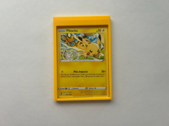
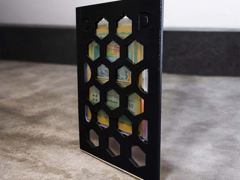
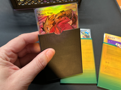

# Downloads: Logística Pokémon

4 arquivo(s) de terceiros em 4 item(ns). Cada item tem pasta própria, função resumida, nome anterior, autoria e licença.

A prévia ajuda a reconhecer o modelo; para imprimir, abra o item e confira as plates e o perfil no Flash Studio.

| Prévia | Item | O que é | Maior peça (mm) | AD5X |
| --- | --- | --- | --- |
|  | [Bulk TCG Card Mailer — Holds 5 sleeved cards](bulk-tcg-card-mailer-holds-5-sleeved-cards/README.md) | Estojo de envio para até cinco cartas TCG com sleeve. | 75.53 × 102.8 × 6.29 | peças cabem |
|  | [pokemon card frame (sleeve version)](pokemon-card-frame-sleeve-version/README.md) | Moldura protetora para uma carta Pokémon com sleeve. | 71.0 × 44.0 × 98.0 | peças cabem |
|  | [Tcg shipping / Top Loader / Slip sleeve / Bubble](tcg-shipping-top-loader-slip-sleeve-bubble/README.md) | Protetor de envio de cartas; a descrição original avisa que este 3MF causa problemas de impressão. | 99.6 × 150.4 × 4.49 | peças cabem |
|  | [UniCard- Case for Inner Sleeved TCG Card](unicard-case-for-inner-sleeved-tcg-card/README.md) | Case de transporte para uma carta TCG com inner sleeve. | 5.84 × 68.05 × 90.0 | peças cabem |

AD5X indica se cada peça cabe individualmente na cama; a disposição conjunta das plates precisa ser conferida no Flash Studio. Autor, licença e perfil estão no README de cada item. Os dados completos estão em [index.json](../../index.json).
