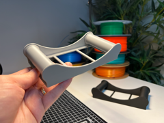

# Downloads: Manutenção de impressoras

5 arquivo(s) de terceiros em 5 item(ns). Cada item tem pasta própria, função resumida, nome anterior, autoria e licença.

A prévia ajuda a reconhecer o modelo; para imprimir, abra o item e confira as plates e o perfil no Flash Studio.

| Prévia | Item | O que é | Maior peça (mm) | AD5X |
| --- | --- | --- | --- |
|  | [A1 / A1 Mini Lube Nozzle - X-Axis Lubrication](a1-a1-mini-lube-nozzle-x-axis-lubrication/README.md) | Bico de lubrificação do eixo X da Bambu A1/A1 mini. | 18.72 × 10.46 × 27.01 | peças cabem |
|  | [A1 / A1 Mini Lube Nozzle - Y-Axis Lubrication](a1-a1-mini-lube-nozzle-y-axis-lubrication/README.md) | Bico de lubrificação do eixo Y da Bambu A1/A1 mini. | 10.45 × 13.76 × 39.11 | peças cabem |
|  | [Flashforge Guide V2](flashforge-guide-v2/README.md) | Guia de filamento para impressora FlashForge. | 70.0 × 36.0 × 98.7 | peças cabem |
|  | [Grease Nozzle - Z-Axis Lubrication](grease-nozzle-z-axis-lubrication/README.md) | Bico aplicador de graxa para eixo Z. | 10.45 × 15.89 × 41.31 | peças cabem |
|  | [Universal Spool Holder with Bearings - Filament Holder for your Desk for Bambulab A1 mini, P1P, X1](universal-spool-holder-with-bearings-filament-holder-for-your/README.md) | Suporte de rolo de filamento com rolamentos. | 90.8 × 174.0 × 37.6 | peças cabem |

AD5X indica se cada peça cabe individualmente na cama; a disposição conjunta das plates precisa ser conferida no Flash Studio. Autor, licença e perfil estão no README de cada item. Os dados completos estão em [index.json](../../index.json).
