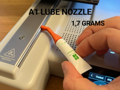

# A1 / A1 Mini Lube Nozzle - Y-Axis Lubrication

Bico de lubrificação do eixo Y da Bambu A1/A1 mini.

## Arquivos

| Arquivo | Nome anterior | Maior peça (mm) | Perfil embutido | Trocar perfil? |
| --- | --- | --- | --- | --- |
| [lubenozzlea1.3mf](lubenozzlea1.3mf) | `LubeNozzleA1.3mf` | 10.45 × 13.76 × 39.11 | Bambu Lab A1 mini | sim |

**Autor:** fifindr  
**Licença:** Standard Digital File License
**Peças cabem individualmente na AD5X:** sim

Este item é um download de terceiro. A prévia pode mostrar uma foto promocional, uma renderização da malha ou só uma das plates. As medidas consideram cada peça separadamente; confira a disposição das plates e o perfil no Flash Studio antes de imprimir.
