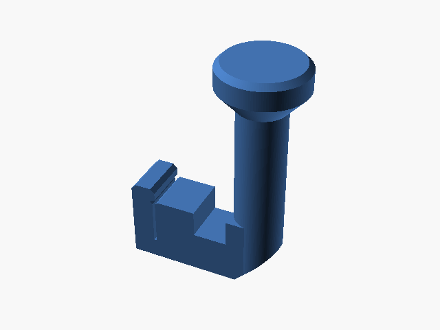

# Flashforge Guide V2

Guia de filamento para impressora FlashForge.

## Arquivos

| Arquivo | Nome anterior | Maior peça (mm) | Perfil embutido | Trocar perfil? |
| --- | --- | --- | --- | --- |
| [flashforge-guide-v2.stl](flashforge-guide-v2.stl) | `Flashforge_Guide_V2.stl` | 70.0 × 36.0 × 98.7 | sem perfil identificado | a confirmar |

**Autor:** a confirmar  
**Licença:** a confirmar
**Peças cabem individualmente na AD5X:** sim

**Nota:** Guia de filamento da AD5X, com caveira em relevo no topo. STL puro, sem perfil de fatiador embutido — orientar e fatiar no Flash Studio.

Este item é um download de terceiro. A prévia pode mostrar uma foto promocional, uma renderização da malha ou só uma das plates. As medidas consideram cada peça separadamente; confira a disposição das plates e o perfil no Flash Studio antes de imprimir.
