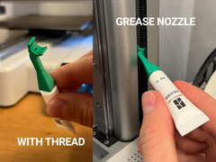

# Grease Nozzle - Z-Axis Lubrication

Bico aplicador de graxa para eixo Z.

## Arquivos

| Arquivo | Nome anterior | Maior peça (mm) | Perfil embutido | Trocar perfil? |
| --- | --- | --- | --- | --- |
| [greasenozzle.3mf](greasenozzle.3mf) | `GreaseNozzle.3mf` | 10.45 × 15.89 × 41.31 | Bambu Lab A1 mini | sim |

**Autor:** fifindr  
**Licença:** Standard Digital File License
**Peças cabem individualmente na AD5X:** sim

Este item é um download de terceiro. A prévia pode mostrar uma foto promocional, uma renderização da malha ou só uma das plates. As medidas consideram cada peça separadamente; confira a disposição das plates e o perfil no Flash Studio antes de imprimir.
