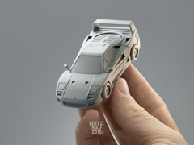
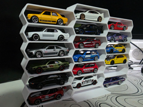
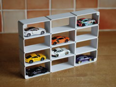
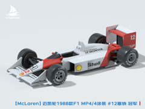

# Downloads: Miniaturas e expositores

5 arquivo(s) de terceiros em 5 item(ns). Cada item tem pasta própria, função resumida, nome anterior, autoria e licença.

A prévia ajuda a reconhecer o modelo; para imprimir, abra o item e confira as plates e o perfil no Flash Studio.

| Prévia | Item | O que é | Maior peça (mm) | AD5X |
| --- | --- | --- | --- |
|  | [Ferrari F40 & Competizion kit card](ferrari-f40-amp-competizion-kit-card/README.md) | Kit card de miniaturas Ferrari F40 e Competizione. | 77.99 × 96.3 × 11.02 | peças cabem |
|  | [Formula One - Redbull Racing RB20 F1 Unveiling](formula-one-redbull-racing-rb20-f1-unveiling/README.md) | Miniatura de exposição do Red Bull RB20 de Fórmula 1. | 157.37 × 71.33 × 34.12 | peças cabem |
|  | [Modular Hot Wheels stand](modular-hot-wheels-stand/README.md) | Expositor modular para miniaturas de carros. | 92.56 × 164.0 × 33.0 | peças cabem |
|  | [Modular Hotwheels Wall Display (Multiple Sizes)](modular-hotwheels-wall-display-multiple-sizes/README.md) | Expositor modular de parede para carrinhos Hot Wheels. | 135.0 × 180.0 × 40.0 | peças cabem |
|  | [【Mclaren】迈凯轮1988款F1赛车MP4/4涂装 Senna传奇冠军车 组装/轮胎可动](mclaren-1988-f1-mp4-4-senna/README.md) | Miniatura montável do McLaren MP4/4 de Fórmula 1. | 67.29 × 36.18 × 78.26 | peças cabem |

AD5X indica se cada peça cabe individualmente na cama; a disposição conjunta das plates precisa ser conferida no Flash Studio. Autor, licença e perfil estão no README de cada item. Os dados completos estão em [index.json](../../index.json).
