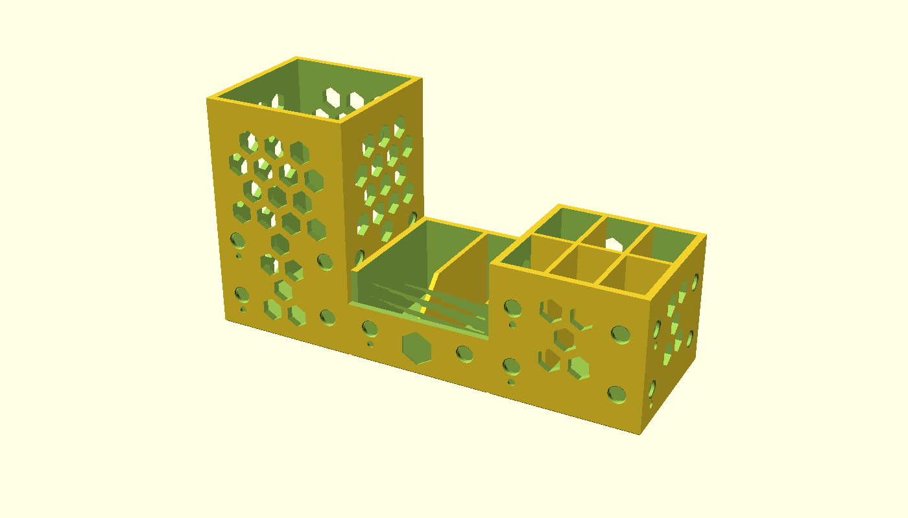
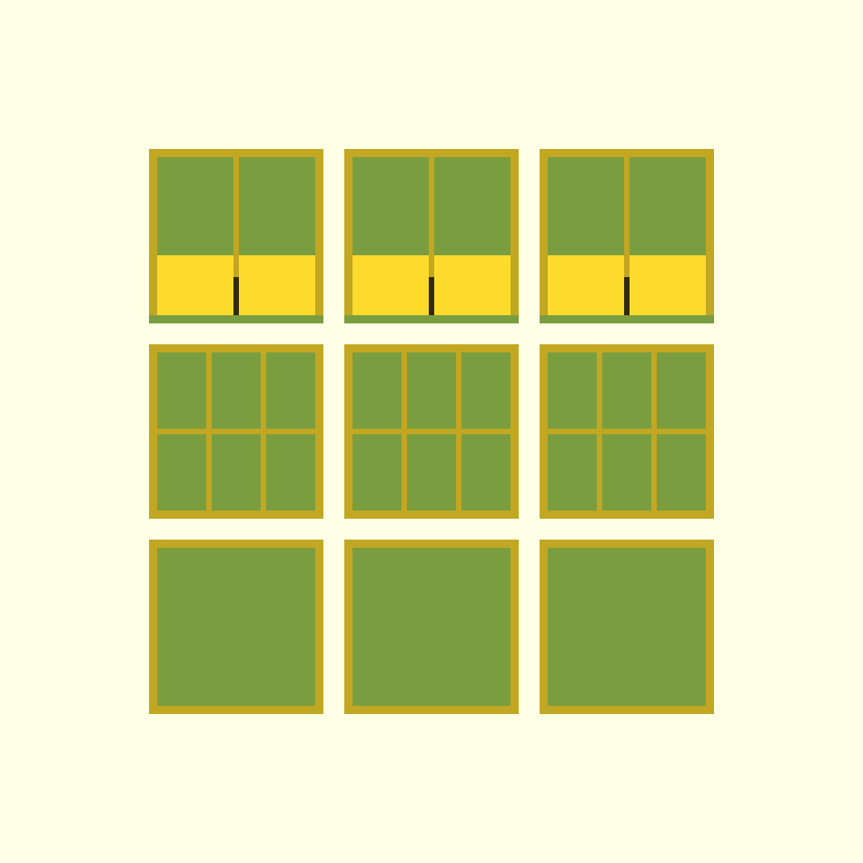

# snap-organizer-01

Organizador **modular "snap"** de bancada. Três módulos de mesmo footprint
(**50 × 50 mm**, o passo da grade) e **alturas diferentes**, que se unem lado
a lado por **ímãs de disco 5 × 1 mm** embutidos nas quatro paredes. Encostou,
grudou. Puxou de lado, soltou.

| Módulo | Altura | Interno | Para quê |
|---|---|---|---|
| `canetas`   | 80 mm | copo único 45,2 × 45,2 × 78 mm | caneta, lápis, pincel, régua, estilete em pé |
| `pendrives` | 45 mm | **6 nichos** de 14,0 × 21,8 mm, piso em z = 10 | pen drive, leitor SD, dongle, adaptador USB-C em pé |
| `parafusos` | 30 mm (frente 19 mm) | 2 cubas de 21,8 × 45,2 mm com rampa de 45° | parafuso, porca, arruela, bits — separados por bitola |

Peça única por módulo, impressa **na orientação de uso**, **sem suporte**.

*Os três módulos encostados: a fileira de ímãs cai na mesma cota nos três.*

## O plano Z comum dos ímãs (é o coração do projeto)

Módulos de alturas diferentes só grudam um no outro se os ímãs estiverem na
**mesma cota Z**. Por isso a fileira principal é ancorada baixo e é
**obrigatória em todos os módulos**:

| Fileira | Centro (z) | Existe em | Ímãs por parede |
|---|---|---|---|
| 1 — **universal** | **12 mm** do piso | canetas, pen drives, parafusos **e** na parede baixa de 19 mm do parafusos | 2 |
| 2 — reforço | 32 mm | só parede ≥ 37,975 mm: canetas e pen drives | 2 |

- **canetas ↔ pen drives**: 4 ímãs por junta (as duas fileiras).
- **qualquer coisa ↔ parafusos**: 2 ímãs por junta (a fileira universal).
- Ímãs por módulo: canetas 16, pen drives 16, parafusos 8. Jogo de 3 = **40 ímãs**.

Uma fileira só nasce se `z + Ø_da_boca/2 + 3 mm ≤ altura da parede` (mínimos
**17,975** e **37,975 mm**). É por isso que a parede da frente do parafusos foi
rebaixada para **19 mm** e não menos: abaixo de 18 mm ela perderia a fileira
universal e aquela face deixaria de grudar.

## REGRA DE POLARIDADE — ler antes de colar

Cada parede tem **duas COLUNAS** de ímãs, simétricas em relação ao centro
(a 8 mm e a 42 mm da quina, ou seja ±17 mm do centro). Nas paredes altas cada
coluna tem 2 ímãs (uma fileira em z = 12 e outra em z = 32).

> **Olhando uma parede DE FORA: a COLUNA da ESQUERDA é NORTE (pra fora), a
> COLUNA da DIREITA é SUL (pra fora).**
> Todo bolso da coluna esquerda — **em todas as fileiras** — tem um **ponto
> gravado** logo abaixo (Ø2,4 mm, 0,7 mm de fundo, 5,5 mm abaixo do centro do
> seu ímã). **Ponto = coluna NORTE.**

Por que funciona em qualquer rotação: quando duas paredes se encostam, olhar
uma "de fora" é olhar na direção oposta da outra — então a **esquerda de uma
sempre encontra a direita da outra**. Norte encontra Sul, atrai. Como as
quatro paredes de todo módulo são marcadas do mesmo jeito, isso vale girando
o módulo 90°, 180° ou 270°, e vale entre alturas diferentes.

### Procedimento de colagem (cola instantânea)

O critério é de **COLUNA**, não de bolso isolado — os dois ímãs da coluna
esquerda vão do mesmo jeito, os dois da direita vão do jeito oposto.

1. Os ímãs vêm empilhados — na pilha, todos apontam pro mesmo lado. Marque
   com caneta permanente a face de cima do ímã do topo e **sempre tire da
   pilha pela mesma ponta**.
2. **Coluna da ESQUERDA** (a que tem o ponto gravado): cole com a face
   marcada virada **pra dentro** (contra o fundo do bolso) — nos **dois**
   bolsos da coluna.
3. **Coluna da DIREITA** (sem ponto): cole com a face marcada virada **pra
   fora** — nos **dois** bolsos da coluna.
4. **Teste antes de colar em série**: cole uma coluna inteira num módulo,
   encoste ímãs soltos nos bolsos do módulo vizinho e veja se atrai **nas
   duas fileiras**. Se repelir em alguma, inverta — e só então cole os 40.
5. **Um pingo MÍNIMO de cola.** Depois de colar, passe a unha na parede: se
   sentir o ímã, tire e reduza a cola. Ímã sobrando pra fora impede as
   paredes de encostarem e estraga o passo de 50 mm da grade.

### O bolso do ímã

| | |
|---|---|
| Ø nominal do bolso | 5,35 mm (`magnet_fit_d = 0,35`) |
| Ø real entre faces ($fn = 64) | 5,344 mm → **0,34 mm de folga diametral** |
| Profundidade | 1,25 mm (`magnet_fit_z = 0,25`) |
| Chanfro na boca | 0,3 × 45° (Ø da boca 5,95 mm) |
| Pele sólida atrás | 1,15 mm (≈ 3 linhas de 0,4) |
| Ímã afundado | 0,25 mm nominal |
| Ar entre dois ímãs com as paredes encostadas | 0,50 mm |

O bolso **não é press-fit de propósito**. O ímã é colado de qualquer jeito,
disco de neodímio lasca quando forçado, e furo de eixo horizontal em parede
vertical ainda encolhe 0,1–0,3 mm na impressão — errar pro lado folgado é de
graça. E 1,25 mm de fundo garante que o ímã não sobre pra fora nem com disco
0,1 mm acima do nominal mais um filete de cola.

## FORÇA DA JUNTA — é de alinhamento, não estrutural

Números que valem conhecer antes de montar:

- Junta de **4 ímãs**: ~8,4 N na normal, contra ~1,05 N de cisalhamento que o
  canetas carregado exige. Sobra folgado pro uso normal.
- Mas por **alavanca**, ~**64 gf** aplicados no topo do canetas já descolam
  uma junta de **2 ímãs**.
- O **canetas sozinho tomba com ~19 gf** de empurrão lateral (centro de massa
  a 59,4 mm com 12 canetas, ângulo de tombamento 22,8°). **Acoplado ao pen
  drives sobe pra ~62 gf.**

**Recomendação de uso: o canetas SEMPRE acoplado, de preferência ao pen
drives** (junta de 4 ímãs), não ao parafusos (junta de 2). O pen drives é a
peça mais pesada do jogo (~43,6 cm³ de material) com metade da altura do
canetas — é o contrapeso natural dele.

## Decisões de projeto (e por quê)

- **2 cubas no parafusos, não 4.** Com 4 cada cuba teria 21,8 × 21,8 mm,
  estreita demais pra pinçar um parafuso com dois dedos. Com 2, cada uma mede
  21,8 × 45,2 mm e o dedo entra pelo lado comprido. Quem precisa de mais
  categorias imprime **mais módulos** — é pra isso que serve a grade de 50 mm.
  Volume por cuba: **24,4 cm³** até o aro de 30 mm, **13,6 cm³** até a boca de
  despejo de 19 mm (que é o que dá pra encher sem derramar ao inclinar).
- **Frente rebaixada + rampa a 45°.** A parede da frente para em 19 mm e por
  dentro sobe uma rampa a 45° (avanço de 17 mm, sobram 28,2 mm de piso plano).
  O uso principal é **tombar o módulo pra frente e despejar**; a 45° a rampa
  também serve pra **varrer parafuso com o dedo** até a borda. (Era 60° na
  primeira versão — não servia: aço em PLA tem ângulo de repouso de ~17°, então
  a 60° nada ficava parado e o parafuso escorregava de volta assim que o dedo
  saía.)
- **A divisória do parafusos acompanha a rampa.** O topo dela sai de 19 mm na
  boca e sobe a 45° até o aro de 30 mm, em vez de atravessar a boca de despejo
  como uma lâmina de 1,6 × 11 mm.
- **Costela transversal no pen drives** — é funcional, não decorativa. Sem
  ela, um item de 20 mm tinha 25,2 mm de curso livre ao longo da canaleta e
  **caía deitado** (35,8° de inclinação), com a ponta saindo 4,6 mm pra fora
  do footprint de 50 mm e batendo no módulo vizinho. Com a costela sobram
  1,8 mm de folga → **2,9°**.
- **Paredes do parafusos sem furo.** Hexágono passante deixaria parafuso e
  arruela pequena escaparem (e, com só ~10 mm de parede livre acima da faixa
  dos ímãs, sobraria 1 hexágono por parede — pattern quebrado, contra a
  regra 4 do CLAUDE.md). Em vez disso, cada parede leva **um hexágono
  ponta-pra-cima GRAVADO** (0,8 mm), centrado entre as duas colunas.
- **Colmeia passante** nas paredes do canetas (20 hexágonos por parede) e do
  pen drives (5). Padrão **centrado na parede**, hexágonos de ponta pra cima
  (imprimem sem ponte reta) e com faixa sólida de 3,5 mm nas bordas + 3 mm de
  folga em volta da boca de cada bolso e de cada ponto de polaridade — nada de
  lasca e nada de furo em cima de ímã.
- **Recessos são cortados na CASCA**, antes de qualquer divisória ser unida.
  Senão um hexágono da parede abre uma janela de 0,2 mm na divisória atrás
  dela e liga dois nichos vizinhos.
- **Alívio de pé de elefante** de 0,6 mm a 45° na base de todo módulo.
- **Nada em relevo nas faces externas** — só recessos. Qualquer saliência
  impediria as paredes de encostarem.

## Faixa aceita pelo módulo de pen drives

O usuário não mediu um pen drive específico, então a geometria foi feita
tolerante e está parametrizada. Com 35 mm de engate:

| | Faixa | Inclinação resultante |
|---|---|---|
| **espessura** (através da canaleta, 14,0 mm) | **8 a 13 mm** | 9,7° a 1,6° |
| **largura** (ao longo do nicho, 21,8 mm) | **16 a 21,8 mm** | 9,4° a 0° |
| **comprimento** | a partir de ~45 mm | pen drive de 55 mm sobra **20 mm** pra pegar |

Um pen drive típico de 10 × 20 mm dá **6,5°** no eixo estreito e **2,9°** no
comprido. Abaixo de 8 mm de espessura o item começa a bambear (3 mm daria
17,4°); nesse caso, reduzir `slot_count` pra 4 canaletas (10,1 mm) ou calçar.

**Se o usuário medir os pen drives dele com régua, reparametrizar** — a regra
do repo é medida real acima de estimativa.

## Impressão

Jobs em `3mf/` (cama FlashForge AD5X 220 × 220, alvo 210 × 210), todos com os
módulos **de pé, boca pra cima, sem suporte**, 6 mm de vão entre peças:

| Job | Conteúdo | Footprint |
|---|---|---|
| `snap-organizer-01-set.3mf` | 1 canetas + 1 pen drives + 1 parafusos — o jogo inicial, valida a junta entre as 3 alturas | 162 × 50 × 80 mm |
| `snap-organizer-01-canetas-x3.3mf` | 3 canetas | 162 × 50 × 80 mm |
| `snap-organizer-01-pendrives-x3.3mf` | 3 pen drives | 162 × 50 × 45 mm |
| `snap-organizer-01-parafusos-x3.3mf` | 3 parafusos | 162 × 50 × 30 mm |
| `snap-organizer-01-jogo.3mf` | 3 de cada, grade 3 × 3 | 162 × 162 × 80 mm |

**Comece pelo `set`.** Ele valida a junta entre alturas diferentes e a
polaridade com 3 peças, em vez de apostar 20 h de impressão na chapa do jogo,
que é um ponto único de falha. As chapas por tipo são pra depois, quando já se
sabe de qual módulo se quer mais.

Outras combinações: abrir o `.scad` e chamar `plate(n_canetas, n_pendrives,
n_parafusos)` — a grade se monta sozinha com `plate_cols = 3`. Uma chapa de
3 × 3 é o máximo com 6 mm de vão.

Sugestão de fatiamento: 0,2 mm de camada, 3 perímetros (a parede de 2,4 mm
fecha em 6 linhas de 0,4), 15% de preenchimento, **sem suporte**, sem brim.

As únicas superfícies voltadas pra baixo em toda a peça são: o chanfro de pé
de elefante (45° exatos), o teto dos bolsos de ímã (arco de 5,35 mm sobre
1,25 mm de fundo), o teto dos pontos de polaridade (arco de 2,4 mm) e o teto
dos hexágonos ponta-pra-cima — todas autoportantes. A rampa de 45° e a
divisória em rampa do parafusos **não geram balanço nenhum**: são superfícies
que sobem, com material embaixo.

## Parâmetros que valem mexer

| Parâmetro | Padrão | Efeito |
|---|---|---|
| `mod_size` | 50 | passo da grade — muda TUDO, inclusive quantos cabem na cama |
| `h_canetas` / `h_pendrives` / `h_parafusos` | 80 / 45 / 30 | alturas; a fileira 2 aparece sozinha acima de 37,975 mm |
| `magnet_row1_z` | 12 | cota universal dos ímãs — **mudar só se mudar em todos** |
| `magnet_offset` | 17 | afastamento das colunas em relação ao centro (braço de alavanca da junta) |
| `magnet_fit_d` / `magnet_fit_z` | 0,35 / 0,25 | folgas do bolso, **desacopladas** (diâmetro x profundidade) |
| `slot_count` / `slot_floor_h` | 3 / 10 | canaletas e altura de pega do pen drives |
| `parafusos_bins` / `parafusos_front_h` / `parafusos_ramp_angle` | 2 / 19 / 45 | cubas, boca de despejo e rampa |
| `polarity_mark` | true | ponto gravado da coluna NORTE, em todas as fileiras |

## Pendências

- Medida real de um pen drive/dongle do usuário (hoje a faixa é declarada,
  não medida).
- Veredito do **teste físico**: força da junta com 2 ímãs (parafusos) contra 4
  ímãs (canetas/pen drives), e se o pen drive de fato para em pé nos nichos de
  14 × 21,8 mm.
