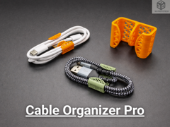
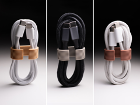
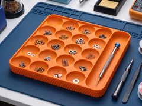
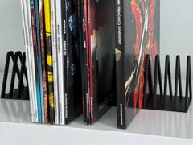
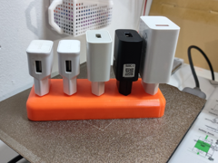
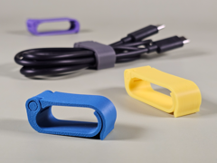
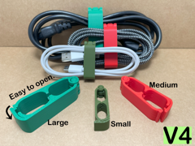
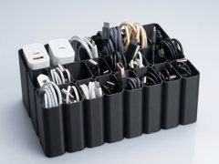
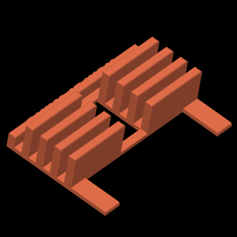

# Downloads: Organizadores

13 arquivo(s) de terceiros em 13 item(ns). Cada item tem pasta própria, função resumida, nome anterior, autoria e licença.

A prévia ajuda a reconhecer o modelo; para imprimir, abra o item e confira as plates e o perfil no Flash Studio.

| Prévia | Item | O que é | Maior peça (mm) | AD5X |
| --- | --- | --- | --- |
|  | [Abraçadeira reutilizável para cabos](abracadeira-reutilizavel-para-cabos/README.md) | Abraçadeira reutilizável para cabos. | 64.41 × 47.49 × 15.0 | peças cabem |
|  | [Cable Organizer Pro](cable-organizer-pro/README.md) | Organizador de cabos com encaixes hexagonais. | 31.0 × 14.0 × 20.0 | peças cabem |
|  | [Cable Organizer v2 / Cable Clip / Cable Winder](cable-organizer-v2-cable-clip-cable-winder/README.md) | Clipes e enroladores de cabo em vários tamanhos. | 43.44 × 23.44 × 14.4 | peças cabem |
|  | [Flexible Spiral Cable Organizer](flexible-spiral-cable-organizer/README.md) | Organizador espiral flexível para cabos. | 16.4 × 16.4 × 200.0 | peças cabem |
|  | [Kepler Tray](kepler-tray/README.md) | Bandeja de bancada com pontos para ímãs. | 180.0 × 180.0 × 16.0 | peças cabem |
|  | [Modern Rectangular Storage Tray](modern-rectangular-storage-tray/README.md) | Bandeja retangular de armazenamento. | 174.99 × 134.99 × 25.0 | peças cabem |
|  | [Modular Vinyl Holder - Ultimate LP Records Storage](modular-vinyl-holder-ultimate-lp-records-storage/README.md) | Rack modular para discos de vinil. | 131.0 × 100.0 × 102.08 | peças cabem |
|  | [Nintendo Switch Game Organizer – 4 Sizes](nintendo-switch-game-organizer-4-sizes/README.md) | Organizador de 12 caixas Switch; referência do projeto próprio switch-case-organizer-01. | 110.1 × 158.25 × 27.0 | peças cabem |
|  | [organizador cargadores](organizador-cargadores/README.md) | organizador cargadores. | 145.0 × 55.0 × 21.5 | peças cabem |
|  | [Presilha para cabos](presilha-para-cabos-epiq3d/README.md) | Presilha para organizar cabos de mesa. | 54.32 × 32.26 × 15.0 | peças cabem |
|  | [Presilhas para cabos](presilhas-para-cabos/README.md) | Presilhas para organizar cabos. | 74.23 × 39.86 × 21.21 | peças cabem |
|  | [USB cable organizer Box tray IPhone Samsung](usb-cable-organizer-box-tray-iphone-samsung/README.md) | Caixa com divisórias para cabos USB. | 96.45 × 130.03 × 75.0 | peças cabem |
|  | [Vinyl_Holder_Remix v10 (remix do 'Modular Vinyl Holder - Ultimate LP Records Storage')](vinyl-holder-remix-v10-remix-do-modular-vinyl-holder-ultimate/README.md) | Porta-vinis NOW PLAYING; referência do projeto próprio vinyl-now-playing-01. | 160.0 × 127.02 × 44.45 | peças cabem |

AD5X indica se cada peça cabe individualmente na cama; a disposição conjunta das plates precisa ser conferida no Flash Studio. Autor, licença e perfil estão no README de cada item. Os dados completos estão em [index.json](../../index.json).
