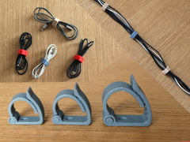

# Abraçadeira reutilizável para cabos

Abraçadeira reutilizável para cabos.

## Arquivos

| Arquivo | Nome anterior | Maior peça (mm) | Perfil embutido | Trocar perfil? |
| --- | --- | --- | --- | --- |
| [cable-tie-final2.3mf](cable-tie-final2.3mf) | `cable+tie+final2.3mf` | 64.41 × 47.49 × 15.0 | Bambu Lab A1 | sim |

**Autor:** StefB  
**Licença:** Standard Digital File License
**Título no 3MF:** Ultimate Cable Management Tie (Different sizes)
**Peças cabem individualmente na AD5X:** sim

**Nota:** Autor, licença, título de origem e perfil extraídos dos metadados embutidos no 3MF; arquivo encontrado fora do catálogo anterior.

Este item é um download de terceiro. A prévia pode mostrar uma foto promocional, uma renderização da malha ou só uma das plates. As medidas consideram cada peça separadamente; confira a disposição das plates e o perfil no Flash Studio antes de imprimir.
