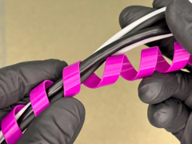

# Flexible Spiral Cable Organizer

Organizador espiral flexível para cabos.

## Arquivos

| Arquivo | Nome anterior | Maior peça (mm) | Perfil embutido | Trocar perfil? |
| --- | --- | --- | --- | --- |
| [flexible-spiral-cable-organizer.3mf](flexible-spiral-cable-organizer.3mf) | `Flexible_Spiral_Cable_Organizer.3mf` | 16.4 × 16.4 × 200.0 | Bambu Lab A1 mini | sim |

**Autor:** a confirmar  
**Licença:** a confirmar
**Peças cabem individualmente na AD5X:** sim

**Nota:** Peça de 200mm de altura. Cabe na AD5X (220), com 20mm de sobra — era o caso que NÃO cabia na A1 mini antiga (180).

Este item é um download de terceiro. A prévia pode mostrar uma foto promocional, uma renderização da malha ou só uma das plates. As medidas consideram cada peça separadamente; confira a disposição das plates e o perfil no Flash Studio antes de imprimir.
