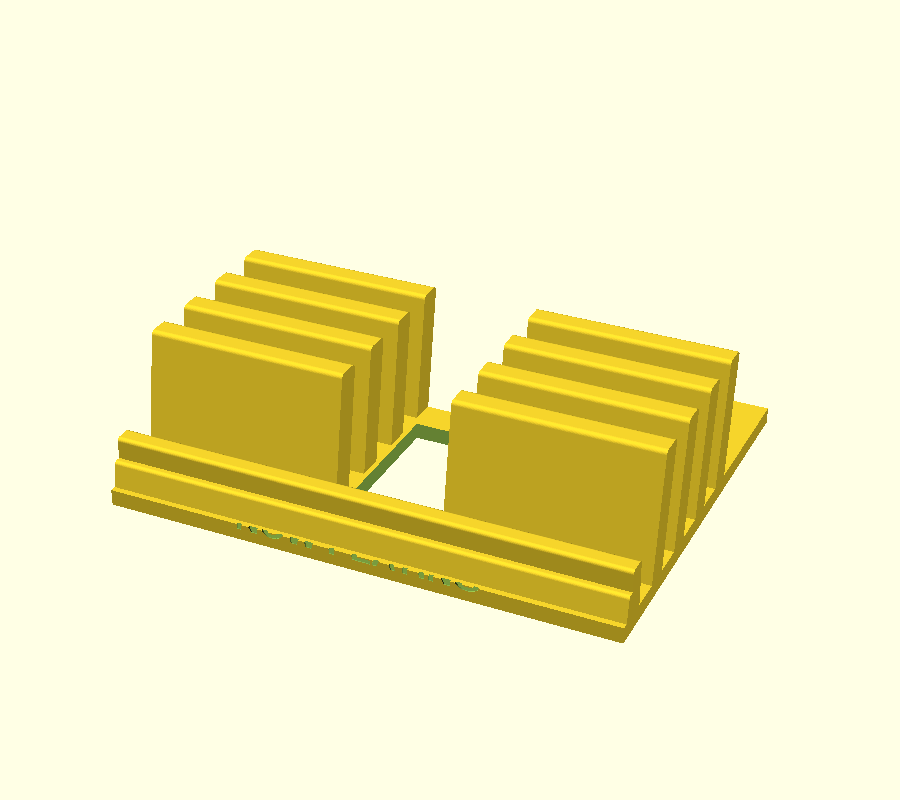

# vinyl-now-playing-01

Porta-vinis de mesa **"NOW PLAYING"**: rack com **2 blocos de 4 aletas
inclinadas** (8 slots pra folhear LPs em pé, capa virada pra frente) e, na
frente, o **berço do disco que está tocando** — barra baixa de 13 mm com a
gravação "NOW PLAYING" + encosto de 20 mm. Peça **única**, sem montagem,
**sem suporte** de impressão.

Reconstrução paramétrica do `../organizador_vinis.3mf` ("Vinyl_Holder_Remix
v10", remix do "Modular Vinyl Holder" do vblack): **todas as medidas por
engenharia reversa da malha** (cortes YZ/XZ com raio-laser, bbox
160 × 127,02 × 44,45 mm), geometria refeita do zero em OpenSCAD — nenhum
triângulo copiado.

## Medidas-chave

| | |
|---|---|
| Envelope | **160 × 127 × 44,45 mm** |
| Blocos de aletas | 2 × 63 mm de largura, canal central de 34 mm |
| Aletas | 4 por bloco, passo 18 mm, espessura 8 mm, inclinação **9°**, topo arredondado r=1,5 |
| Slots | 4 por bloco (3 entre aletas + 1 contra o encosto), vão de **10 mm** na base |
| Base | 5 mm, com janela de 31 × 52 mm no canal e ponte de 11 mm amarrando os blocos |
| Pés traseiros | 2 × 18 × 44 mm — **lastro anti-tombamento** (8 LPs de ~180 g inclinados pra trás) |
| Berço NOW PLAYING | barra de 13 mm (face a 10°, pé em y=1) + encosto de 6 × 19,75 mm em y=5,5–11,5 |

## Como se usa

- Os LPs entram **em pé** nos slots entre aletas, um por slot, e inclinam ~9°
  pra trás apoiando na aleta seguinte — dá pra folhear as capas como numa
  caixa de loja de discos.
- O disco **que está tocando** vai no berço da frente: a borda de baixo da
  capa apoia no topo arredondado da barra e a capa deita no encosto, de
  frente pra quem olha.

## Impressão

Job em `3mf/` (cama FlashForge AD5X 220 × 220, alvo 210 × 210):

| Job | Conteúdo | Footprint |
|---|---|---|
| `vinyl-now-playing-01.3mf` | a peça única, na orientação de uso (base na mesa, aletas pra cima), **sem suporte** | 160 × 127 × 44,5 mm |

Sugestão de fatiamento: 0,2 mm de camada, 2–3 perímetros, 15% de
preenchimento, sem brim (a 1ª camada é a base inteira, ~7.700 mm²). As únicas
superfícies voltadas pra baixo são os arcos de 1,5 mm do topo das aletas —
autoportantes. A janela da base é vazada pra baixo, não é ponte.

## Decisões de projeto (e por quê)

- **Sem colmeia** (exceção consciente à regra 5): as faces visíveis são as
  **faces de 8 mm das aletas** — não existe painel contínuo onde furar, e um
  favo passante numa aleta de 8 mm deixaria parede de ~0,5 mm. Fiel à
  referência, que também é maciça.
- **Quinas arredondadas com `offset(delta=-r)` + `offset(r=r)`**, nunca
  `offset(r)` puro: com `offset(r)` o fundo das aletas descia 1,5 mm **abaixo
  da base** (z = −1,5) e a peça inteira sentava nas pontas das aletas — pego
  no bed-check (bbox saía 127,2 × 47,5 em vez de 127,0 × 44,5).
- **Envelope idêntico ao da referência** (160 × 127 × 44,45), pra manter a
  ergonomia já validada do modelo original.

## Parâmetros que valem mexer

| Parâmetro | Padrão | Efeito |
|---|---|---|
| `fin_count` / `fin_pitch` | 4 / 18 | nº de slots e folga por disco (passo 18 = ~1 LP de capa dupla folgado) |
| `fin_lean` | 9 | inclinação dos discos; mais ângulo = mais estável e mais fundo |
| `fin_h` | 44,45 | altura das aletas (quanto da capa fica apoiada) |
| `channel_w` | 34 | vão central (economia de material + pega) |
| `bar_h` / `rest_h` | 13 / 19,75 | lábio e encosto do berço now playing |
| `label_text` | NOW PLAYING | gravação na barra; `""` desliga |

## Pendências

- Veredito do **teste físico**: folga real do slot de 10 mm com capas
  duplas/gatefold e estabilidade com os 8 slots cheios.
