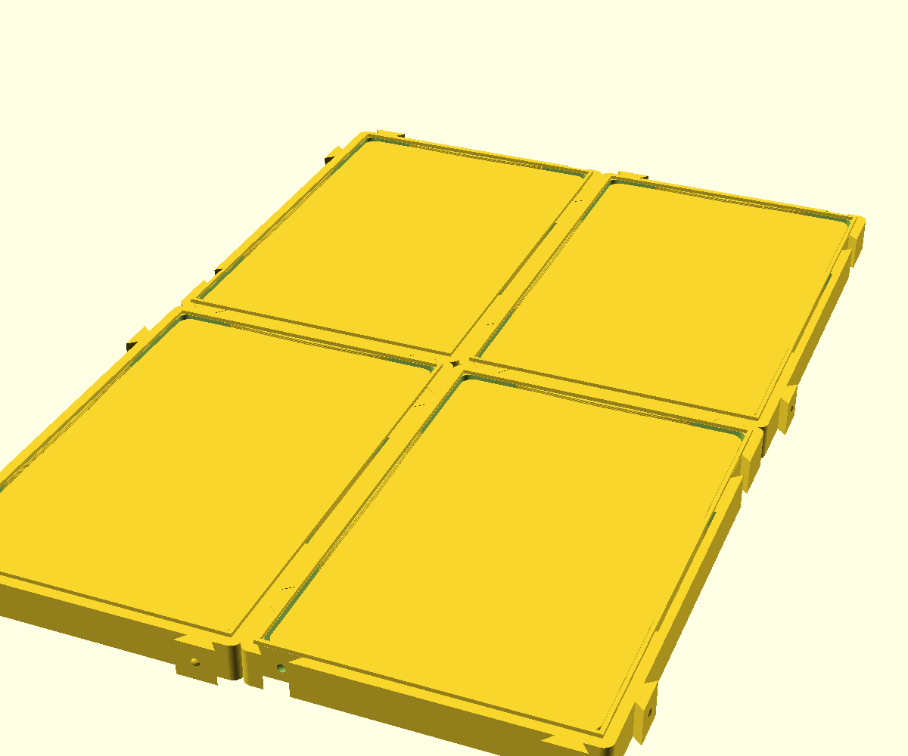

# slab-tile-01

Sistema **modular** para guardar slabs graduadas: cada peça impressa é um
**tile de UMA slab**, e os tiles encaixam lado a lado por rabo-de-andorinha
formando uma **página de fichário** de 2x2 (4 slabs), 3x3 ou 4x4. As páginas
montadas **empilham em torre**, e cada página sai da torre inteira, na mão,
com as slabs à vista pela janela da frente.

## Por que o tile é de uma slab só

A ideia original era imprimir a placa de 4 slabs inteira. **Não cabe em cama
nenhuma**: uma página 2x2 mede **198,6 × 296,6mm** e a AD5X tem 220 × 220.
Então a peça impressa é o tile (99,3 × 148,3mm — cabem **duas por chapa**) e a
página nasce do encaixe. O mesmo tile serve para qualquer tamanho de grade;
não existe peça "de canto" ou "de meio".

## O problema difícil: 7mm de diferença entre graduadoras

Você pediu que aceitasse todo tipo de slab próxima do padrão PSA, ficando de
fora só Beckett e ARS. O envelope da faixa aceita:

| Graduadora | Largura | Altura | Espessura |
|---|---|---|---|
| PSA | ~82,0 | ~136,0 | ~6,0 |
| CGC | ~82,0 | ~136,0 | ~8,0 |
| TAG | ≈ PSA | ≈ PSA | ≈ PSA |
| **SGC** | **~89,0** | **~138,0** | ~7,0 |
| ~~BGS/Beckett~~ | ~~87~~ | ~~133~~ | ~~9~~ (fora) |
| ~~ARS~~ | — | — | — (fora) |

Da PSA para a SGC são **7mm de largura**. Um bolso fixo ou aperta a SGC ou
deixa a PSA dançando 3,5mm de cada lado — e uma slab torta na janela estraga
justamente o que o projeto existe pra fazer, que é exibir a carta.

**Solução: molas de lâmina em arco.** O bolso é dimensionado para a MAIOR da
faixa e três lâminas finas, estufadas para dentro, encostam na slab:

- **duas laterais** (vão de 72mm, estufo 4,55mm, curso **4,15mm**) —
  autocentram a slab em X, então qualquer largura fica alinhada com a janela;
- **uma no topo** (vão de 56mm, estufo 3,7mm, curso **2,9mm**) — encosta a
  slab no piso do bolso, que é a referência de altura.

A lâmina é um arco de círculo de raio `R = (L²/4 + b²) / (2b)`, com `L` o vão
e `b` o estufo — a fórmula sai de igualar a flecha do arco a `b`. Com 1,5mm de
espessura e 72mm de vão, os 4,15mm de curso dão **~0,7% de deformação**, bem
abaixo do escoamento do PLA. Atrás de cada lâmina há um rasgo de alívio de
2,0mm na parede, senão ela não teria para onde fletir.

> Quem tem só um tamanho de slab pode desligar tudo isso com
> `springs = false` e imprimir tiles de bolso liso.

## Como se manuseia

- **Pôr a slab**: entra **por trás**, empurrada para dentro. Os últimos 6mm do
  bolso são uma rampa a ~35° da vertical que abre as molas sozinha — não tem
  que forçar de topo. A slab para no ressalto da frente.
- **Tirar a slab**: empurra com o polegar pela janela da frente.
- **Juntar dois tiles**: eles deslizam **um pelo outro em Z** (o
  rabo-de-andorinha não entra de lado, é isso que segura a página) e travam
  num detente esférico que dá o clique.
- **Empilhar**: um friso perimetral nas costas entra na canaleta da frente da
  página de cima. A frente de uma fecha o fundo da outra, e a slab de baixo
  fica lacrada. Passo da torre = 11,4mm.

## Peças e jobs

| Nome | No código | Job | Footprint (medido no STL) |
|---|---|---|---|
| **gabarito** | `part="test"` | `3mf/slab-tile-01-gabarito.3mf` | 209,9 × 155,2 × 7,7mm (2 peças) |
| **tile** | `part="tile"` | `3mf/slab-tile-01-x2.3mf` | 209,9 × 155,2 × 12,6mm (2 tiles) |

Tile sozinho: **106,2 × 155,2 × 12,6mm** (o bbox inclui os machos que
sobressaem nos dois lados). Página 2x2 = 2 jobs. Uma 4x4 = 8 jobs.

**Os dois tiles vão entrelaçados na chapa.** Como a simetria C2 põe o macho de
+X e o de −X em alturas diferentes, o macho de um passa exatamente na altura
em que o vizinho tem fêmea. Isso derruba a chapa de 212,5 para **209,9mm** e
faz caber no alvo confortável de 210 da AD5X. O ponto de maior aperto entre os
dois tiles é 0,95mm (limite inferior conservador; no macho é bem mais).

## ⚠️ Antes de imprimir: rode o gabarito

O `3mf/slab-tile-01-gabarito.3mf` são **duas fatias finas do tile** (7,7mm em
vez de 12,6), com a mesma pegada em XY: mesmo bolso, mesmas molas, mesmo
rabo-de-andorinha. Serve para duas conferências que **decidem o projeto**:

1. **enfiar uma slab de verdade** e sentir se ela centra e fica firme, sem
   forçar na entrada;
2. **encaixar as duas peças** e conferir o deslize e o clique do detente.

A mola do gabarito é mais baixa que a real, então ela **empurra menos** —
o que se testa aqui é a geometria e o curso, não a força final.

Não passou? Os parâmetros para mexer, nesta ordem: `spring_grip` (o aperto),
`joint_clear` (folga do encaixe) e `pocket_clear` (folga do bolso). Re-exporta
e repete o gabarito.

## Impressão

**Face da FRENTE na cama, bolso para cima. Zero suporte.** A janela é furo
desde a primeira camada, as molas são paredes verticais, e a única saliência —
a rampa de entrada — fica a ~35° da vertical, dentro do que a FDM faz sozinha.
A face de baixo (a que fica na cama) é a face visível da página, então sai com
o melhor acabamento.

## ⚠️ As medidas NÃO vieram da sua régua

Como no `psa-box-01`, o envelope acima veio de catálogo/levantamento, **não de
medição sua**. As três medidas que mandam estão no topo do `.scad`
(`slab_w_max`, `slab_h_max`, `slab_t_max`) e a menor da faixa em
`slab_w_min` / `slab_h_min`.

**Meça com a régua a sua slab MAIS LARGA e a MAIS ESTREITA** e ajuste esses
cinco números — todo o resto (bolso, janela, estufo das molas, curso, tile,
chapa) é derivado e se reajusta sozinho. Os `assert` do `.scad` reprovam o
export se alguma combinação quebrar (mola sem espaço para fletir, encaixe
invadindo o vão da mola, janela passando por baixo da lâmina, chapa estourando
os 210mm).

## Verificações feitas no modelo

Além dos `assert`, o encaixe foi conferido por interseção geométrica — o
mesmo idioma que o `penny-holder-01` usa:

| `part` | O que prova | Resultado |
|---|---|---|
| `fit_x` | dois tiles vizinhos em X não se atravessam | **vazio** ✓ |
| `fit_y` | idem em Y | **vazio** ✓ |
| `gap_x` | o macho realmente ocupa a fêmea do vizinho | não-vazio ✓ |
| `probe_gap` | existe vão de flexão atrás da lâmina | **vazio** ✓ |
| `probe_blade` | a lâmina existe como corpo | não-vazio ✓ |
| `tile` | a peça é um sólido único | `Volumes: 2` ✓ |

`demo` (2x2 montado com slabs de mentira) e `cut` (corte no meio da mola) são
só preview — nunca exportar.

## Pendências

- **Não impresso.** O veredito é o teste físico; rode o gabarito primeiro.
- Nas bordas externas da página os machos ficam à mostra. É o custo do sistema
  modular. Se incomodar, dá para fazer tampinhas de borda depois.
