# Downloads: Organizadores TCG

22 arquivo(s) de terceiros em 22 item(ns). Cada item tem pasta própria, função resumida, nome anterior, autoria e licença.

A prévia ajuda a reconhecer o modelo; para imprimir, abra o item e confira as plates e o perfil no Flash Studio.

| Prévia | Item | O que é | Maior peça (mm) | AD5X |
| --- | --- | --- | --- |
| 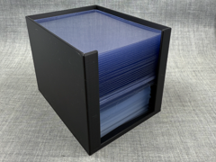 | [2-in-1 Top Loader & Sleeve Holder](2-in-1-top-loader-sleeve-holder/README.md) | Porta-toploaders e porta-penny-sleeves no mesmo suporte. | 82.0 × 107.0 × 84.0 | peças cabem |
|  | [Booster Pack Display Stand (logo)](booster-pack-display-stand-logo/README.md) | Expositor de pacotes de booster TCG com logo. | 175.45 × 135.0 × 30.0 | peças cabem |
| 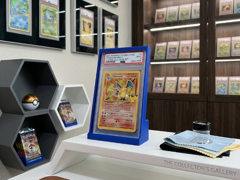 | [display stand for psa, cgc slab](display-stand-for-psa-cgc-slab/README.md) | Suporte de mesa para exibir slab PSA ou CGC. | 44.33 × 85.0 × 138.52 | peças cabem |
|  | [Graded Card Display Frame 1x1](graded-card-display-frame-1x1/README.md) | Moldura de exposição para uma carta graduada. | 98.6 × 19.2 × 146.5 | peças cabem |
| 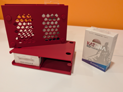 | [Modular Stackable Storage for Card Sleeves](modular-stackable-storage-for-card-sleeves/README.md) | Prateleira modular empilhável para pacotes de cartas. | 160.8 × 67.4 × 109.6 | peças cabem |
|  | [modular_sorting_tray](modular-sorting-tray/README.md) | Bandeja modular para separar cartas ou componentes. | 80.31 × 105.07 × 42.0 | peças cabem |
| 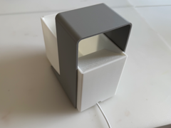 | [MTG Cardscanner](mtg-cardscanner/README.md) | Suporte para digitalizar cartas de Magic com celular. | 81.0 × 145.0 × 110.0 | peças cabem |
| 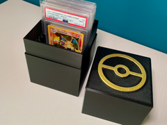 | [NO AMS Scatola porta 10 carte PSA Pokémon Pokéball](no-ams-scatola-porta-10-carte-psa-pokemon-pokeball/README.md) | Caixa para dez slabs PSA com tema Pokébola. | 95.0 × 98.5 × 105.5 | peças cabem |
|  | [Pokemon PSA / CGC / ACE Slab Protector + Stand](pokemon-psa-cgc-ace-slab-protector-stand/README.md) | Case de duas peças e suporte para slabs PSA, CGC e ACE. | 85.4 × 140.0 × 9.5 | peças cabem |
|  | [Pokemon TCG Sleeved Card Holder Dividers](pokemon-tcg-sleeved-card-holder-dividers/README.md) | Porta-cartas Pokémon com sleeve e divisórias. | 138.66 × 104.56 × 1.5 | peças cabem |
|  | [Porta-carta Mimikyu](porta-carta-mimikyu/README.md) | Expositor de carta Pokémon em formato de Mimikyu. | 159.91 × 145.8 × 116.42 | peças cabem |
|  | [PSA Display Stand](psa-display-stand/README.md) | Suporte de mesa para exibir slab PSA. | 200.45 × 153.0 × 30.0 | peças cabem |
|  | [PSA graded card box](psa-graded-card-box/README.md) | Caixa articulada para uma slab PSA. | 102.76 × 145.9 × 94.26 | peças cabem |
| 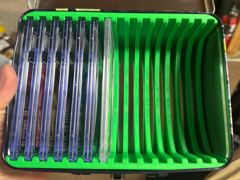 | [PSA/CGC Slab Insert for Pokémon Lunchbox](psa-cgc-slab-insert-for-pokemon-lunchbox/README.md) | Insert de slab PSA/CGC para lancheira Pokémon. | 200.0 × 146.0 × 78.0 | peças cabem |
| ![Sleeved Deck Press for TCG [230g, 6hr]](sleeved-deck-press-for-tcg-230g-6hr/preview.png) | [Sleeved Deck Press for TCG [230g, 6hr]](sleeved-deck-press-for-tcg-230g-6hr/README.md) | Prensa para achatar um deck de cartas com sleeve. | 164.6 × 150.91 × 142.62 | peças cabem |
| 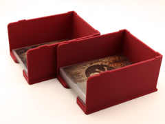 | [Stackable card box](stackable-card-box/README.md) | Caixa empilhável para cartas TCG. | 76.0 × 97.5 × 51.2 | peças cabem |
|  | [Stackable Penny Sleeve Holder - Colmeia 80mm](stackable-penny-sleeve-holder-colmeia-80mm/README.md) | Porta-penny-sleeves empilhável de 80 mm com colmeia. | 74.2 × 102.7 × 80.0 | peças cabem |
| 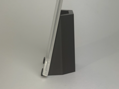 | [Suporte de mesa para slab graduada](suporte-de-mesa-para-slab-graduada/README.md) | Suporte de mesa para cartas TCG e slabs graduadas. | 50.0 × 43.79 × 76.0 | peças cabem |
| 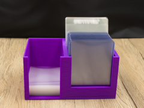 | [TCG Card Caddy](tcg-card-caddy/README.md) | Suporte de mesa para organizar cartas durante o jogo. | 161.0 × 103.0 × 80.0 | peças cabem |
| 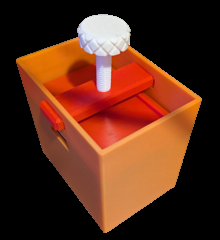 | [TCG Deck Box, Compress Double-Sleeved Cards v2](tcg-deck-box-compress-double-sleeved-cards-v2/README.md) | Prensa de deck com sleeve duplo, versão 2. | 107.0 × 77.0 × 100.0 | peças cabem |
| 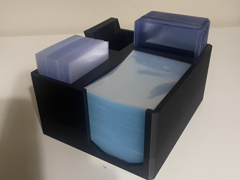 | [TCG Sleeve Station](tcg-sleeve-station/README.md) | Estação de mesa para colocar sleeves em cartas. | 138.0 × 161.57 × 75.0 | peças cabem |
|  | [Ultimate Slab-Box for your graded PSA, Beckett pp.](ultimate-slab-box-for-your-graded-psa-beckett-pp/README.md) | Caixa para guardar até 15 slabs graduadas. | 95.0 × 169.0 × 149.64 | peças cabem |

AD5X indica se cada peça cabe individualmente na cama; a disposição conjunta das plates precisa ser conferida no Flash Studio. Autor, licença e perfil estão no README de cada item. Os dados completos estão em [index.json](../../index.json).
