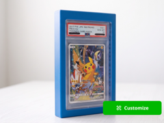

# Graded Card Display Frame 1x1

Moldura de exposição para uma carta graduada.

## Arquivos

| Arquivo | Nome anterior | Maior peça (mm) | Perfil embutido | Trocar perfil? |
| --- | --- | --- | --- | --- |
| [graded-card-display-frame-1x1.3mf](graded-card-display-frame-1x1.3mf) | `Graded_Card_Display_Frame_1x1.3mf` | 98.6 × 19.2 × 146.5 | Bambu Lab A1 mini | sim |

**Autor:** a confirmar  
**Licença:** a confirmar
**Peças cabem individualmente na AD5X:** sim

Este item é um download de terceiro. A prévia pode mostrar uma foto promocional, uma renderização da malha ou só uma das plates. As medidas consideram cada peça separadamente; confira a disposição das plates e o perfil no Flash Studio antes de imprimir.
