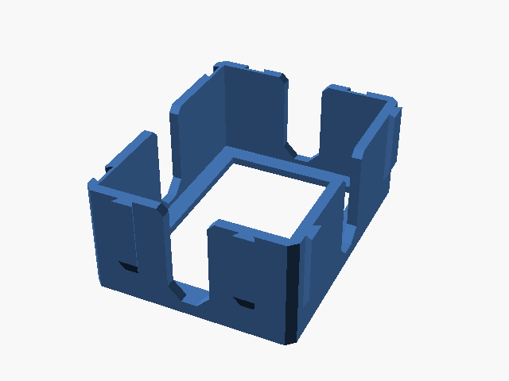

# modular_sorting_tray

Bandeja modular para separar cartas ou componentes.

## Arquivos

| Arquivo | Nome anterior | Maior peça (mm) | Perfil embutido | Trocar perfil? |
| --- | --- | --- | --- | --- |
| [modular-sorting-tray.stl](modular-sorting-tray.stl) | `modular_sorting_tray.stl` | 80.31 × 105.07 × 42.0 | sem perfil identificado | a confirmar |

**Autor:** a confirmar  
**Licença:** não declarada — STL não carrega metadados de autoria/licença
**Peças cabem individualmente na AD5X:** sim

Este item é um download de terceiro. A prévia pode mostrar uma foto promocional, uma renderização da malha ou só uma das plates. As medidas consideram cada peça separadamente; confira a disposição das plates e o perfil no Flash Studio antes de imprimir.
