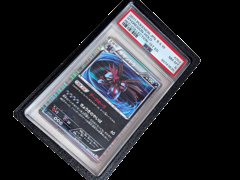

# Pokemon PSA / CGC / ACE Slab Protector + Stand

Case de duas peças e suporte para slabs PSA, CGC e ACE.

## Arquivos

| Arquivo | Nome anterior | Maior peça (mm) | Perfil embutido | Trocar perfil? |
| --- | --- | --- | --- | --- |
| [slab-protectors.3mf](slab-protectors.3mf) | `Slab_Protectors.3mf` | 85.4 × 140.0 × 9.5 | Bambu Lab A1 mini | sim |

**Autor:** Pluviora  
**Licença:** Standard Digital File License
**Peças cabem individualmente na AD5X:** sim

Este item é um download de terceiro. A prévia pode mostrar uma foto promocional, uma renderização da malha ou só uma das plates. As medidas consideram cada peça separadamente; confira a disposição das plates e o perfil no Flash Studio antes de imprimir.
