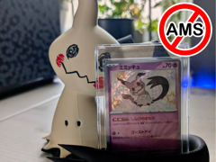

# Porta-carta Mimikyu

Expositor de carta Pokémon em formato de Mimikyu.

## Arquivos

| Arquivo | Nome anterior | Maior peça (mm) | Perfil embutido | Trocar perfil? |
| --- | --- | --- | --- | --- |
| [mimikyu-card-holder-high-res.3mf](mimikyu-card-holder-high-res.3mf) | `Mimikyu_card_holder_high_res.3mf` | 159.91 × 145.8 × 116.42 | Bambu Lab A1 mini | sim |

**Autor:** Czetti  
**Licença:** Standard Digital File License
**Título no 3MF:** Mimikyu Pokemon Card Display NO AMS
**Peças cabem individualmente na AD5X:** sim

**Nota:** Autor, licença, título de origem e perfil extraídos dos metadados embutidos no 3MF; arquivo encontrado fora do catálogo anterior.

Este item é um download de terceiro. A prévia pode mostrar uma foto promocional, uma renderização da malha ou só uma das plates. As medidas consideram cada peça separadamente; confira a disposição das plates e o perfil no Flash Studio antes de imprimir.
