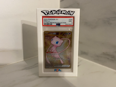

# PSA Display Stand

Suporte de mesa para exibir slab PSA.

## Arquivos

| Arquivo | Nome anterior | Maior peça (mm) | Perfil embutido | Trocar perfil? |
| --- | --- | --- | --- | --- |
| [psa-display-stand.3mf](psa-display-stand.3mf) | `PSA_Display_Stand.3mf` | 200.45 × 153.0 × 30.0 | Bambu Lab A1 mini | sim |

**Autor:** a confirmar  
**Licença:** a confirmar
**Peças cabem individualmente na AD5X:** sim

**Nota:** Uma das peças mede 200.4mm. Cabe na AD5X (220) — era o caso que NÃO cabia na A1 mini antiga (180).

Este item é um download de terceiro. A prévia pode mostrar uma foto promocional, uma renderização da malha ou só uma das plates. As medidas consideram cada peça separadamente; confira a disposição das plates e o perfil no Flash Studio antes de imprimir.
