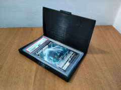

# PSA graded card box

Caixa articulada para uma slab PSA.

## Arquivos

| Arquivo | Nome anterior | Maior peça (mm) | Perfil embutido | Trocar perfil? |
| --- | --- | --- | --- | --- |
| [psa-card-box.3mf](psa-card-box.3mf) | `PSA_card_box.3mf` | 102.76 × 145.9 × 94.26 | Bambu Lab A1 mini | sim |

**Autor:** Axelburn  
**Licença:** Standard Digital File License
**Peças cabem individualmente na AD5X:** sim

Este item é um download de terceiro. A prévia pode mostrar uma foto promocional, uma renderização da malha ou só uma das plates. As medidas consideram cada peça separadamente; confira a disposição das plates e o perfil no Flash Studio antes de imprimir.
