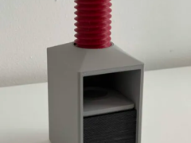

# Sleeved Deck Press for TCG [230g, 6hr]

Prensa para achatar um deck de cartas com sleeve.

## Arquivos

| Arquivo | Nome anterior | Maior peça (mm) | Perfil embutido | Trocar perfil? |
| --- | --- | --- | --- | --- |
| [deck-box-squsher-1.3mf](deck-box-squsher-1.3mf) | `Deck_Box_-_Squsher_-_1.3mf` | 164.6 × 150.91 × 142.62 | Bambu Lab A1 mini | sim |

**Autor:** Bobu Studio  
**Licença:** Standard Digital File License
**Peças cabem individualmente na AD5X:** sim

Este item é um download de terceiro. A prévia pode mostrar uma foto promocional, uma renderização da malha ou só uma das plates. As medidas consideram cada peça separadamente; confira a disposição das plates e o perfil no Flash Studio antes de imprimir.
