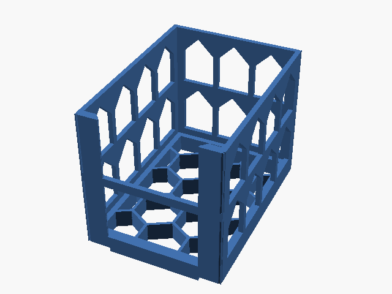

# Stackable Penny Sleeve Holder - Colmeia 80mm

Porta-penny-sleeves empilhável de 80 mm com colmeia.

## Arquivos

| Arquivo | Nome anterior | Maior peça (mm) | Perfil embutido | Trocar perfil? |
| --- | --- | --- | --- | --- |
| [pennysleeveholder-stackable-colmeia-80mm.3mf](pennysleeveholder-stackable-colmeia-80mm.3mf) | `PennySleeveHolder_Stackable_Colmeia_80mm.3mf` | 74.2 × 102.7 × 80.0 | Bambu Lab A1 mini | sim |

**Autor:** Sazabi  
**Licença:** MakerWorld Exclusive License
**Peças cabem individualmente na AD5X:** sim

Este item é um download de terceiro. A prévia pode mostrar uma foto promocional, uma renderização da malha ou só uma das plates. As medidas consideram cada peça separadamente; confira a disposição das plates e o perfil no Flash Studio antes de imprimir.
