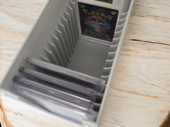

# Ultimate Slab-Box for your graded PSA, Beckett pp.

Caixa para guardar até 15 slabs graduadas.

## Arquivos

| Arquivo | Nome anterior | Maior peça (mm) | Perfil embutido | Trocar perfil? |
| --- | --- | --- | --- | --- |
| [slab-box.3mf](slab-box.3mf) | `Slab-Box.3mf` | 95.0 × 169.0 × 149.64 | Bambu Lab P1S | sim |

**Autor:** 3D-Druck Nienburg  
**Licença:** Standard Digital File License
**Peças cabem individualmente na AD5X:** sim

Este item é um download de terceiro. A prévia pode mostrar uma foto promocional, uma renderização da malha ou só uma das plates. As medidas consideram cada peça separadamente; confira a disposição das plates e o perfil no Flash Studio antes de imprimir.
