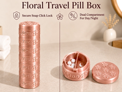
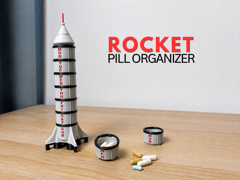
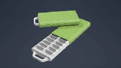
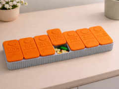

# Downloads: Caixas de remédio

4 arquivo(s) de terceiros em 4 item(ns). Cada item tem pasta própria, função resumida, nome anterior, autoria e licença.

A prévia ajuda a reconhecer o modelo; para imprimir, abra o item e confira as plates e o perfil no Flash Studio.

| Prévia | Item | O que é | Maior peça (mm) | AD5X |
| --- | --- | --- | --- |
|  | [Floral Travel Pill Box – Secure Snap Click Lock](floral-travel-pill-box-secure-snap-click-lock/README.md) | Porta-comprimidos de viagem com fecho. | 48.97 × 48.9 × 26.85 | peças cabem |
|  | [Rocket Pill Box / Stackable Storage Box / Modular](rocket-pill-box-stackable-storage-box-modular/README.md) | Porta-comprimidos modular em formato de foguete. | 85.45 × 85.45 × 46.2 | peças cabem |
|  | [Simple Pill Box](simple-pill-box/README.md) | Caixa simples de comprimidos com fechamento magnético. | 25.1 × 84.83 × 153.0 | peças cabem |
|  | [Weekly Pill Organizer,Pill Box – Morning & Evening](weekly-pill-organizer-pill-box-morning-amp-evening/README.md) | Organizador semanal de comprimidos, manhã e noite. | 178.85 × 51.1 × 16.79 | peças cabem |

AD5X indica se cada peça cabe individualmente na cama; a disposição conjunta das plates precisa ser conferida no Flash Studio. Autor, licença e perfil estão no README de cada item. Os dados completos estão em [index.json](../../index.json).
