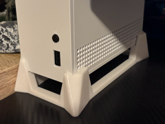
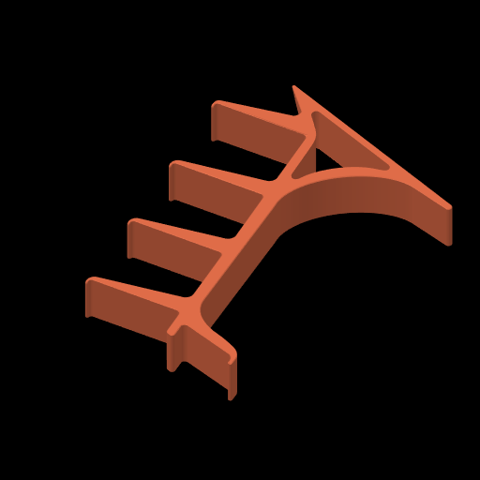
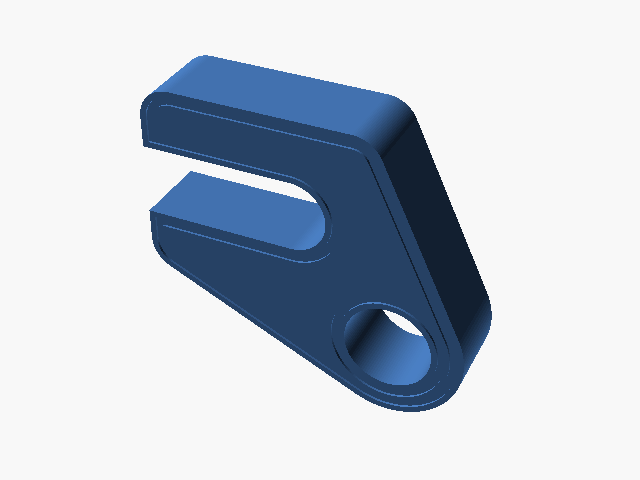
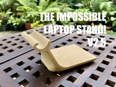
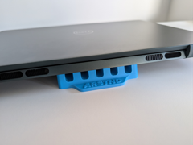
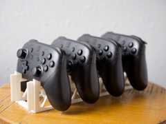
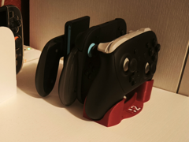

# Downloads: Suportes

18 arquivo(s) de terceiros em 16 item(ns). Cada item tem pasta própria, função resumida, nome anterior, autoria e licença.

A prévia ajuda a reconhecer o modelo; para imprimir, abra o item e confira as plates e o perfil no Flash Studio.

| Prévia | Item | O que é | Maior peça (mm) | AD5X |
| --- | --- | --- | --- |
|  | [Apoio de notebook a 50 graus](apoio-de-notebook-a-50-graus/README.md) | Apoio de notebook com inclinação de 50 graus. | 151.66 × 37.44 × 20.0 | peças cabem |
|  | [Base para console Xbox Series S](base-para-console-xbox-series-s/README.md) | Base de resfriamento passivo para Xbox Series S, com variantes de perfil AD5X e Bambu A1 mini. | 87.95 × 215.0 × 43.98 | cabe; margem curta |
|  | [Controller Stand x4](controller-stand-x4/README.md) | Chapa de quatro suportes de controle; o perfil salvo está a 84% para caber na AD5X. | 211.24 × 168.48 × 32.48 | cabe; margem curta |
|  | [Foldable Phone stand - 8 different versions](foldable-phone-stand-8-different-versions/README.md) | Suporte dobrável para celular em várias versões. | 80.0 × 160.0 × 15.24 | peças cabem |
|  | [HeadPhone Holder](headphone-holder/README.md) | Suporte de mesa para fone de ouvido. | 55.0 × 63.0 × 52.0 | peças cabem |
|  | [Headphone side desk stand](headphone-side-desk-stand/README.md) | Suporte lateral de mesa para fone de ouvido. | 99.99 × 69.92 × 30.0 | peças cabem |
|  | [Laptopständer](laptopstander/README.md) | Suporte de mesa para notebook. | 25.0 × 64.99 × 19.5 | peças cabem |
|  | [Minimalist Laptop Stand / Ergonomic Laptop Risers](minimalist-laptop-stand-ergonomic-laptop-risers/README.md) | Apoios ergonômicos para elevar notebook. | 207.18 × 69.08 × 30.0 | peças cabem |
|  | [Nintendo Switch Lite Sleeve](nintendo-switch-lite-sleeve/README.md) | Bainha de mesa pra Switch Lite sem capa; referência do projeto próprio switch-lite-stand-01. | 201.07 × 185.58 × 95.0 | peças cabem |
|  | [Suporte de controle Xbox (duas peças STL)](suporte-controle-xbox-stl/README.md) | Duas peças STL de um suporte de controle Xbox; montagem e origem a confirmar. | 211.08 × 108.47 × 47.67 | cabe; margem curta |
|  | [Suporte de fixação (função a confirmar)](soportenootbook/README.md) | Peça de apoio ou fixação; a aplicação exata não está documentada no arquivo. | 82.0 × 20.0 × 74.0 | peças cabem |
|  | [Suporte dobrável para notebook](suporte-dobravel-para-notebook/README.md) | Suporte dobrável para notebook, versão 2.5. | 157.77 × 149.79 × 120.0 | peças cabem |
|  | [Suporte inclinado para notebook](suporte-inclinado-para-notebook/README.md) | Suporte inclinado que eleva o notebook para ventilação. | 100.0 × 41.0 × 16.88 | peças cabem |
|  | [Suporte para controle Nintendo Switch](suporte-para-controle-nintendo-switch/README.md) | Suporte modular para controle Nintendo Switch Pro. | 74.59 × 69.85 × 71.02 | peças cabem |
|  | [Suporte para controle Switch 2 Pro](suporte-para-controle-switch-2-pro/README.md) | Suporte para controle Nintendo Switch 2. | 126.83 × 180.2 × 35.0 | peças cabem |
|  | [Xbox Controller Stand lines by Pork3D.com](xbox-controller-stand-lines-by-pork3d-com/README.md) | Suporte vazado para controle Xbox; referência do projeto próprio xbox-stand-01. | 50.0 × 170.0 × 25.0 | peças cabem |

AD5X indica se cada peça cabe individualmente na cama; a disposição conjunta das plates precisa ser conferida no Flash Studio. Autor, licença e perfil estão no README de cada item. Os dados completos estão em [index.json](../../index.json).
