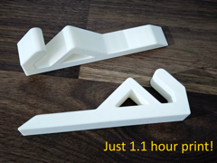

# Apoio de notebook a 50 graus

Apoio de notebook com inclinação de 50 graus.

## Arquivos

| Arquivo | Nome anterior | Maior peça (mm) | Perfil embutido | Trocar perfil? |
| --- | --- | --- | --- | --- |
| [laptop-prop-50deg-154mm.3mf](laptop-prop-50deg-154mm.3mf) | `laptop+prop+50deg-154mm.3mf` | 151.66 × 37.44 × 20.0 | Bambu Lab A1 mini | sim |

**Autor:** Chapapa  
**Licença:** Standard Digital File License
**Título no 3MF:** Minimalist laptop stand prop (fast print, 50°)
**Peças cabem individualmente na AD5X:** sim

**Nota:** Autor, licença, título de origem e perfil extraídos dos metadados embutidos no 3MF; arquivo encontrado fora do catálogo anterior.

Este item é um download de terceiro. A prévia pode mostrar uma foto promocional, uma renderização da malha ou só uma das plates. As medidas consideram cada peça separadamente; confira a disposição das plates e o perfil no Flash Studio antes de imprimir.
