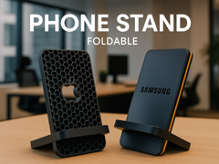

# Foldable Phone stand - 8 different versions

Suporte dobrável para celular em várias versões.

## Arquivos

| Arquivo | Nome anterior | Maior peça (mm) | Perfil embutido | Trocar perfil? |
| --- | --- | --- | --- | --- |
| [phoneholder-fillet-corner-honeycombv2.3mf](phoneholder-fillet-corner-honeycombv2.3mf) | `Phoneholder_fillet_corner_honeycombv2.3mf` | 80.0 × 160.0 × 15.24 | Bambu Lab P1S | sim |

**Autor:** MartinRimerS  
**Licença:** Standard Digital File License
**Peças cabem individualmente na AD5X:** sim

Este item é um download de terceiro. A prévia pode mostrar uma foto promocional, uma renderização da malha ou só uma das plates. As medidas consideram cada peça separadamente; confira a disposição das plates e o perfil no Flash Studio antes de imprimir.
