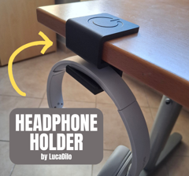

# HeadPhone Holder

Suporte de mesa para fone de ouvido.

## Arquivos

| Arquivo | Nome anterior | Maior peça (mm) | Perfil embutido | Trocar perfil? |
| --- | --- | --- | --- | --- |
| [headphone-holder.3mf](headphone-holder.3mf) | `headphone_holder.3mf` | 55.0 × 63.0 × 52.0 | Bambu Lab A1 mini | sim |

**Autor:** LucaDilo  
**Licença:** Standard Digital File License
**Peças cabem individualmente na AD5X:** sim

Este item é um download de terceiro. A prévia pode mostrar uma foto promocional, uma renderização da malha ou só uma das plates. As medidas consideram cada peça separadamente; confira a disposição das plates e o perfil no Flash Studio antes de imprimir.
