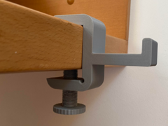

# Headphone side desk stand

Suporte lateral de mesa para fone de ouvido.

## Arquivos

| Arquivo | Nome anterior | Maior peça (mm) | Perfil embutido | Trocar perfil? |
| --- | --- | --- | --- | --- |
| [headphone-stand-parafuso.3mf](headphone-stand-parafuso.3mf) | `headphone-stand-parafuso.3mf` | 99.99 × 69.92 × 30.0 | Bambu Lab X1 Carbon | sim |

**Autor:** Gugly  
**Licença:** BY
**Peças cabem individualmente na AD5X:** sim

Este item é um download de terceiro. A prévia pode mostrar uma foto promocional, uma renderização da malha ou só uma das plates. As medidas consideram cada peça separadamente; confira a disposição das plates e o perfil no Flash Studio antes de imprimir.
