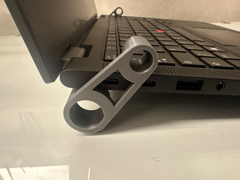

# Laptopständer

Suporte de mesa para notebook.

## Arquivos

| Arquivo | Nome anterior | Maior peça (mm) | Perfil embutido | Trocar perfil? |
| --- | --- | --- | --- | --- |
| [laptopstander.3mf](laptopstander.3mf) | `Laptopständer.3mf` | 25.0 × 64.99 × 19.5 | Bambu Lab A1 | sim |

**Autor:** Woodvalley-Design  
**Licença:** Standard Digital File License
**Peças cabem individualmente na AD5X:** sim

Este item é um download de terceiro. A prévia pode mostrar uma foto promocional, uma renderização da malha ou só uma das plates. As medidas consideram cada peça separadamente; confira a disposição das plates e o perfil no Flash Studio antes de imprimir.
