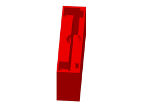

# Nintendo Switch Lite Sleeve

Bainha de mesa pra Switch Lite sem capa; referência do projeto próprio switch-lite-stand-01.

## Arquivos

| Arquivo | Nome anterior | Maior peça (mm) | Perfil embutido | Trocar perfil? |
| --- | --- | --- | --- | --- |
| [nintendo-switch-lite-sleeve.3mf](nintendo-switch-lite-sleeve.3mf) | `Nintendo Switch Lite Sleeve.3mf` | 201.07 × 185.58 × 95.0 | Bambu Lab P1S | sim |

**Autor:** desconhecido  
**Licença:** desconhecida
**Peças cabem individualmente na AD5X:** sim
**Projeto próprio relacionado:** [suportes/switch-lite-stand-01](../../../suportes/switch-lite-stand-01/README.md)

**Nota:** Arquivo encontrado solto na raiz do repo, fora do contrato de pastas. O 3MF não traz autor, título nem licença (só DesignerUserId 1968188830; Bambu Studio 1.10.02, 2025-07-27). Fatiado pra P1S em TPU, 0.2mm, 15% de infill, sem suporte, brim automático. Bloco maciço de 220 x 54 x 95 com slot de 210 x 16 x 90 pro Switch Lite SEM capa, rebaixo pra dedo R12, 2 bolsos de 30 x 22 atrás e 2 de 20 x 9 na frente.

**Medida:** A malha é um bloco de 220 x 54 x 95, mas o 3MF salva o objeto girado ~41° na plate; a caixa medida na orientação salva é 201.07 x 185.58 x 95. Reto, os 220 ocupam a cama inteira da AD5X.

Este item é um download de terceiro. A prévia pode mostrar uma foto promocional, uma renderização da malha ou só uma das plates. As medidas consideram cada peça separadamente; confira a disposição das plates e o perfil no Flash Studio antes de imprimir.
