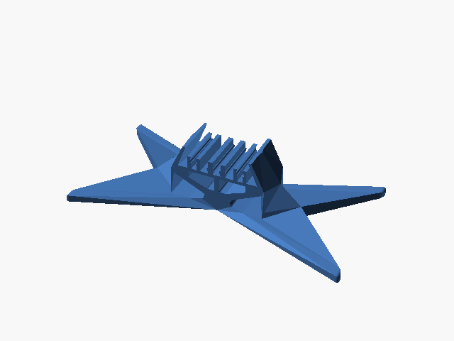

# Suporte de controle Xbox (duas peças STL)

Duas peças STL de um suporte de controle Xbox; montagem e origem a confirmar.

**Atenção: uma peça passa do limite de conforto de 210 mm; confira a margem para brim.**

## Arquivos

| Arquivo | Nome anterior | Maior peça (mm) | Perfil embutido | Trocar perfil? |
| --- | --- | --- | --- | --- |
| [xbox-controller-holder.stl](xbox-controller-holder.stl) | `Xbox_controller_holder.stl` | 203.06 × 132.64 × 35.02 | sem perfil identificado | a confirmar |
| [xbox-controller-stand.stl](xbox-controller-stand.stl) | `Xbox_controller_stand.stl` | 211.08 × 108.47 × 47.67 | sem perfil identificado | a confirmar |

**Autor:** a confirmar  
**Licença:** a confirmar
**Peças cabem individualmente na AD5X:** sim

**Nota:** Arquivo de terceiro encontrado no repositório sem registro anterior no catálogo; origem e licença a confirmar.

Este item é um download de terceiro. A prévia pode mostrar uma foto promocional, uma renderização da malha ou só uma das plates. As medidas consideram cada peça separadamente; confira a disposição das plates e o perfil no Flash Studio antes de imprimir.
